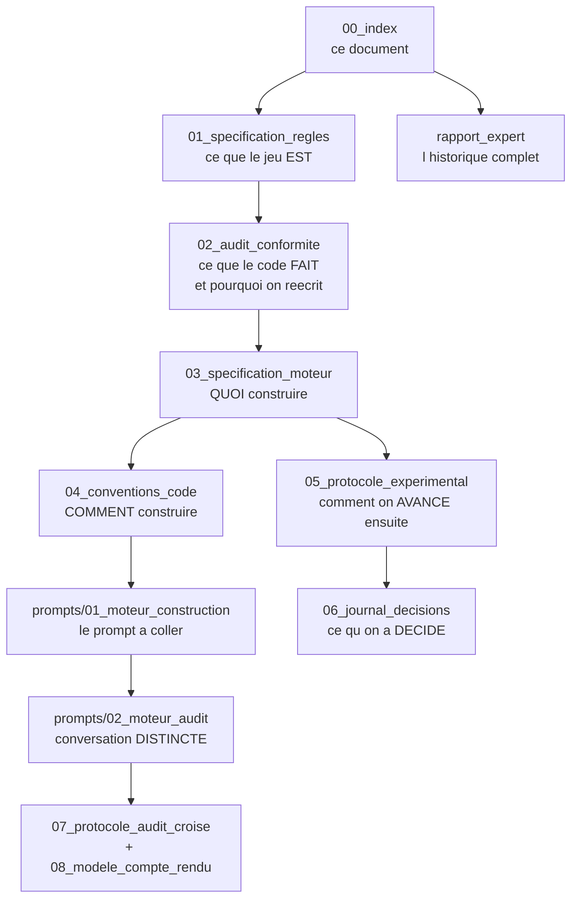

# Courtisans — document racine

**Point d'entrée du projet. Où on en est, ce qui est vrai, ce qu'on fait ensuite, et dans quel document c'est écrit.**

Mis à jour le 15/08/2026.

---

## 1. Le projet en une page

Courtisans est un jeu de cartes à information imparfaite. L'objectif est une **IA forte,
jouable dans l'interface, d'abord à 3 joueurs**, puis 2, puis 4.

| | |
|---|---|
| Jeu | 6 familles × 5 rôles × 3 exemplaires = 90 cartes |
| Moteur | `courtisans/` — **réécrit et conforme**, 2 à 4 joueurs, adaptateur OpenSpiel. L'ancien `app/jeu.py` n'est pas dans ce dépôt |
| Interface | Streamlit, adversaire par défaut = greedy PIMC |
| Approche IA | famille CFR à 2 joueurs ; méthode de population au-delà |
| Vérité-terrain | exploitabilité à 2 joueurs ; Elo contre pool au-delà |

**Historique en une phrase.** Une première approche AlphaZero/MCTS a été abandonnée sur
résultat négatif documenté — la valeur d'un état d'information n'est pas un scalaire bien
défini en information imparfaite. Le pivot vers CFR/Deep CFR a validé cinq briques
successives, puis a buté sur un plafond d'exploitabilité à 2.1e.

**État au 15/08/2026 : campagne CFR suspendue.** L'audit a établi que le plafond invoqué
repose sur une métrique faussée, et surtout que **les instances d'entraînement
n'implémentent pas les règles du jeu**. Le projet reprend par une phase de mise en
conformité.

---

## 2. Les documents, dans l'ordre de lecture

> **Ce document n'est pas le point d'entrée de Florian.** Le document qui dit quoi faire,
> quel prompt coller et dans quelle conversation, c'est **[../PILOTE.md](../PILOTE.md)**.
> Celui-ci est l'index du corpus de référence, consultable par toi et par les agents.

| Document | Répond à | Statut |
|---|---|---|
| **[01_regles.md](01_regles.md)** | Quelles sont les règles exactes, à 2, 3 et 4 joueurs ? | **À valider** — arbitrage humain requis, §11 |
| **[02_audit_conformite.md](02_audit_conformite.md)** | Le code respecte-t-il ces règles ? Que garde-t-on ? | Établi |
| **[03_specification_moteur.md](03_specification_moteur.md)** | Quoi construire : architecture, API, invariants, critères d'acceptation | Établi |
| **[04_conventions_code.md](04_conventions_code.md)** | Comment construire, et pourquoi chaque règle | Établi |
| **[../prompts/01_moteur_construction.md](../prompts/01_moteur_construction.md)** | Le prompt à coller dans une conversation neuve | **Prêt** — après validation de 01 |
| **[../prompts/02_moteur_audit.md](../prompts/02_moteur_audit.md)** | Le prompt d'audit, pour une conversation distincte | **Prêt** |
| **[05_protocole_experimental.md](05_protocole_experimental.md)** | Comment on avance ensuite, avec quels critères d'arrêt | Établi |
| **[06_journal_decisions.md](06_journal_decisions.md)** | Qu'a-t-on testé, trouvé, décidé, et quand ? | Vivant |
| **[07_protocole_audit_croise.md](07_protocole_audit_croise.md)** | Comment un agent en audite un autre : contrôles A1-A7, verdicts | Établi |
| **[08_modele_compte_rendu.md](08_modele_compte_rendu.md)** | Le format imposé de tout compte rendu d'agent | Établi |
| `rapport_expert.md` | Historique complet, brique par brique (2 695 lignes) | Archive — **sur la branche `cfr-pivot`**, arrive avec le fast-forward |

> **Le dépôt est sur `main`, qui est figé au 26 mai.** Tout le travail CFR — `cfr/`,
> `rapport_expert.md`, `etat_des_lieux_et_roadmap.md` — est sur `origin/cfr-pivot`, qui
> contient l'intégralité de `main` plus 16 commits. Aucune divergence : le fast-forward est
> trivial. Il est bloqué par un `.git/index.lock` vide daté du 15/08 19h30 (point ouvert n° 5).

Les autres fichiers de `documentations/` (`architecture_technique`, `entrainement`,
`leviers_apprentissage`, `configuration`, `streamlit_app_spec`, `ameliorations`) sont des
archives de la période AlphaZero. Ils restent consultables mais ne font pas autorité.

---

## 3. Ce qui est établi, et avec quelle certitude

Trois niveaux, jamais confondus : **mesuré** (exécuté et lu), **déduit** (lu et raisonné,
non exécuté), **simulé** (reproduit indépendamment, pas observé sur le run réel).

| Fait | Niveau | Source |
|---|---|---|
| Le meurtre de l'Assassin est **obligatoire** dans les instances alors qu'il est facultatif | **Déduit** (lecture de `_legal_actions`) — impact **mesuré** : 20 % des résolutions, 1,34 pt, sur évaluation myope | [02](02_audit_conformite.md) §3 |
| Les tours sont **inégaux** dans les instances : P0 joue 2 tours, P1 un seul | **Mesuré** (exécution) | [02](02_audit_conformite.md) §4.1 |
| L'ordre de pose intra-tour est **sans effet** à 2 joueurs | **Mesuré** (0 cas sur 24) — non vérifié à 3 et 4 joueurs | [02](02_audit_conformite.md) §2.1 |
| La métrique d'exploitabilité joue **uniforme** sur les info-sets non couverts | **Déduit** (lecture de `buffer_exact_fn`) | [02](02_audit_conformite.md) §5 |
| La couverture du buffer plafonne à **64.9 %** au budget du run | **Simulé**, borne supérieure — la sémantique de traversée a été réimplémentée, pas observée. À confirmer par P3.0 (10 s) | [02](02_audit_conformite.md) §5 |
| Le goulot est **CPU mono-thread**, le GPU est inutilisé | **Mesuré** (débit) + **déduit** (`device="cpu"` en dur) | [02](02_audit_conformite.md) §6 |
| L'encodage info-set est **injectif** — 475 000 info-sets ↔ 475 000 tenseurs | **Mesuré** avec réserve — voir ci-dessous | [02](02_audit_conformite.md) §2.2 |
| La canonicalisation par symétrie des familles est **lossless** | Établi antérieurement, non revérifié | `rapport_expert.md` §31 |

**Réserve sur l'injectivité.** La traversée shardée utilisée sur l'instance combo emploie un
`setdefault` : une répétition du même info-set **à l'intérieur** d'un shard n'était pas
comparée. Seules les collisions **entre** shards étaient détectées. Le contrôle complet n'a
été exécuté que sur l'instance 2.1c (123 921 états, 0 collision). Sur 2.1e, l'absence de
collision inter-info-sets est solide ; la cohérence des actions légales au sein d'un info-set
est **partiellement vérifiée**. Ce contrôle devient l'invariant I9 du nouveau moteur, testé
automatiquement.

**Non vérifié.** Le comportement de `is_done` à 4 joueurs a été **déduit** d'une docstring,
présenté à tort comme mesuré, puis la vérification par exécution a produit un harnais faux
(`step()` ne lève pas sur assassin en attente, la partie s'arrêtait au premier tour). **Le
point reste ouvert** — sans conséquence, puisque le moteur est réécrit.

**Ce qui n'est plus établi.** La conclusion « mur de variance à 455k info-sets, donc
ESCHER/DREAM » du `rapport_expert.md` §34 est **suspendue** : elle repose sur un chiffre non
comparable aux briques précédentes. Le diagnostic est rouvert en phase 3.

---

## 4. Ce qu'on fait maintenant

Les durées ci-dessous sont des **temps d'exécution machine**, mesurés ou extrapolés de
mesures. Aucune estimation de temps de développement n'est donnée : elles ne seraient pas
fondées.

| Phase | Objet | Exécution | Bloquante |
|---|---|---:|---|
| **0** | ~~Moteur conforme réécrit~~ — **close le 17/08, audit croisé compris** : 576 tests verts, 8 critères d'acceptation atteints, 18 mutations sur 18 détectées, couverture 618/618. Verdict de l'auditeur : **ACCEPTÉ SOUS RÉSERVE**. | tests : 205 s | **oui** |
| **1** | **Instance d'entraînement** — 4 familles, 3 joueurs, conforme | quelques min | **oui** |
| **2** | **Banc de test 2 joueurs** — instance symétrique + oracle CFR+ + métrique corrigée | oracle ~4 h | **oui** |
| **3** | **Diagnostic du plafond** — trancher entre les 3 hypothèses | P3.0 : 10 s · P3.1 : ~3 h · P3.2 : ~20 min GPU | **oui** |
| 4 | Algorithme — SD-CFR, puis ESCHER si besoin | run ~2 h | non |
| 5 | Passage à 3 joueurs — Elo contre pool | 1 000 parties appariées : ~1 h | non |
| 6 | 4 joueurs | idem | non |

**Aucun run individuel ne dépasse 4 h**, checkpoint toutes les 15 min. La phase 3 est la
plus rentable : elle commence par une lecture de log de dix secondes qui peut clore le
diagnostic.

Détail, hypothèses, critères go/no-go : [05_protocole_experimental.md](05_protocole_experimental.md).

### La première chose à faire

1. ~~Valider [01_regles.md](01_regles.md)~~ — **fait**, les quatre arbitrages du §11 sont
   tranchés les 15 et 16/08.
2. **Fast-forward de `main` sur `cfr-pivot`**, et tag `alphazero-final` — sur l'ancien dépôt.
3. ~~Coller [../prompts/01_moteur_construction.md](../prompts/01_moteur_construction.md)~~ —
   **fait, les huit étapes.** Puis l'audit croisé — action 4 — qui a rejeté une
   première fois, puis accepté sous réserve après deux tours de correction.
   **État final : 576 tests verts, les 8 critères d'acceptation atteints,
   18 mutations sur 18 détectées, couverture 618/618.** Neuf défauts trouvés et
   corrigés. Voir l'entrée du 17/08 au
   [journal](06_journal_decisions.md).
4. **Écrire les prompts de la phase 1** — construction et audit, sur le modèle des
   deux premiers.

---

## 5. Les décisions structurantes déjà prises

| Décision | Choix | Pourquoi |
|---|---|---|
| Repartir de zéro ? | **Le moteur est réécrit ; le dépôt et la documentation sont conservés** | Le moteur ne peut pas être certifié : seules ~30 % de ses 719 lignes ont été auditées, et chaque relecture a révélé un écart de plus (N1, N2, N3). Relire 719 lignes contre la spec coûte le même temps que les réécrire **tests en premier** — à coût égal, la réécriture donne un moteur certifié par construction. On garde la documentation (5 380 lignes), `greedy_bot.py` comme référence de comportement, et l'infra oracle. |
| 3 joueurs d'abord ? | **Oui, directement.** Le juge est le greedy PIMC en parties appariées, pas l'exploitabilité. | À 3 joueurs il n'y a pas d'équilibre de Nash unique : CFR perd ses garanties et l'exploitabilité cesse d'être une cible. Voir [05](05_protocole_experimental.md) §1. |
| Quel algorithme après le diagnostic ? | **SD-CFR avant ESCHER** | SD-CFR attaque exactement le composant diagnostiqué, à une variable près. [03](05_protocole_experimental.md) §4 |
| Que faire du code AlphaZero ? | **Tag `alphazero-final` puis suppression** | Le résultat négatif reste consultable, le dépôt redevient lisible. [02](02_audit_conformite.md) §7.2 |

---

## 6. La règle de conduite

Toute expérience passe par la boucle en huit étapes du protocole
([03](05_protocole_experimental.md) §0), dont quatre règles non négociables :

1. **L'hypothèse s'écrit avant l'expérience** — falsifiable, avec le résultat attendu dans les deux cas.
2. **Pas de tunnel** — on déclare à l'avance la durée à laquelle la métrique devient décisive ; si on ne sait pas le dire, on redessine l'expérience. Plafond : 4 h par run en phase exploratoire.
3. **Le résultat est audité avant d'être cru** — mesure-t-il ce qu'on croit ? sur quel support ? comparable au précédent ?
4. **Le plan est challengé à chaque tour** — un résultat peut rendre les phases suivantes caduques.

La règle 3 est celle qui manquait : le plafond à 0.190 jouait uniforme sur 35 % du jeu, et
personne ne l'a vu pendant toute une brique.

---

## 7. Points ouverts

| # | Question | Bloque |
|---|---|---|
| 3 | Instance 2 joueurs : symétrique **avec** pioche coûte 369 600 donnes contre 924 **sans**. Lequel des deux mécanismes sacrifie-t-on ? | Phase 2 |
| 5 | `.git/index.lock` bloque les commits depuis le 15/08 19h30 — **sur l'ancien dépôt** ; celui-ci n'est pas encore un dépôt git | Versionnement |
| 7 | `app/greedy_bot.py` et `cfr/solve_mini.py` ne sont pas dans ce dépôt — **normal**, ils n'appartiennent pas à la phase moteur et arriveront pour les phases 2 et 3 | Phases 2 et 3 |
| 8 | **La canonicalisation par permutation des familles n'est pas implémentée.** Elle exige une traduction de l'espace d'actions que le §4 de [03](03_specification_moteur.md) ne définit pas ; la moitié du mécanisme produirait un agent qui croit poser une carte et en pose une autre. Étape à part entière, spécification d'abord. | Phase 3 |
| 9 | **L'encodage par cible de la phase de ciblage n'est pas écrit.** Sa forme dépend du réseau qui le consomme. | Phase 3 |

**Fermés le 16/08 :**

| # | Question | Réponse |
|---|---|---|
| 1 | Validation de la spec de règles | Tranchée par l'auteur les 15 et 16/08, §11 de [01](01_regles.md) |
| 2 | À 3+ joueurs, peut-on poser deux cartes chez le même adversaire ? | **Non** — §3.2 et R1 de [01](01_regles.md) : structure fixe, une seule carte part chez un adversaire |
| 4 | Confrontation à la règle officielle du jeu de plateau | **Sans objet** — R7 : variante de l'auteur, sa validation fait autorité |
| — | Reproduction des instances historiques `mini`, `assassin`, `redeal`, `combo` | **Supprimée.** Elles violent les règles et sont non constructibles sous les planchers du §8. Remplacées par `entrainement-3j`, `complet-3j`, `complet-2j` — voir [03](03_specification_moteur.md) §3 |
| — | Nœuds de chance | **Explicites dans l'adaptateur OpenSpiel**, pas dans le cœur. `reset(seed)` reste le mécanisme de déterminisme — voir [03](03_specification_moteur.md) §4 |
