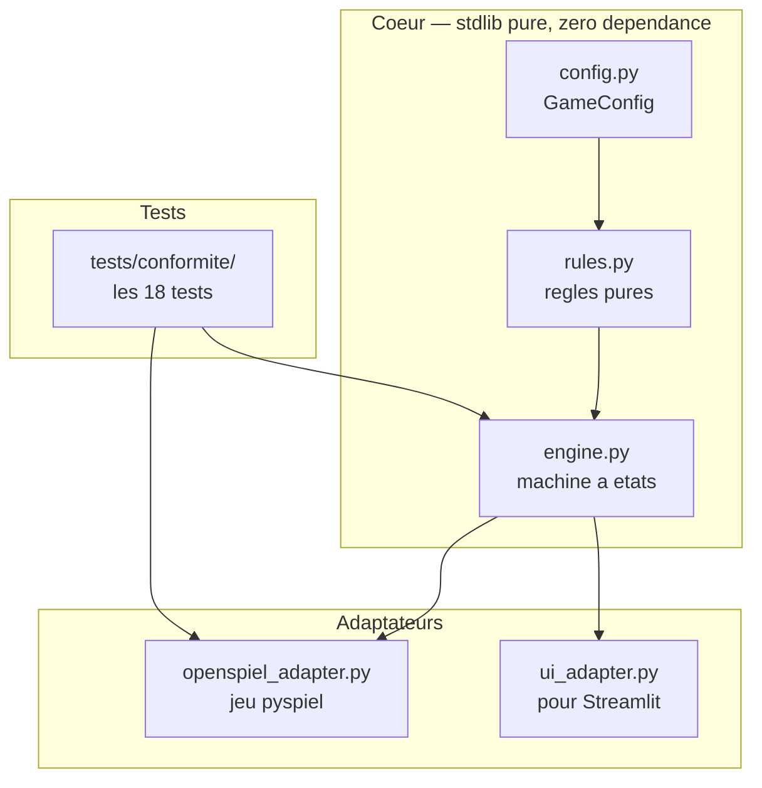

# Spécification du moteur — ce qu'il faut construire

**Le moteur de règles à écrire, son architecture, son API, ses invariants et ses critères d'acceptation.**

Ce document dit **quoi** construire. Le **comment** est dans
[04_conventions_code.md](04_conventions_code.md). Les **règles du jeu** sont dans
[01_regles.md](01_regles.md), qui fait seule autorité sur le
contenu des règles. **Pourquoi** on réécrit : [02_audit_conformite.md](02_audit_conformite.md).

---

## 1. Périmètre

### 1.1 Ce que le moteur fait

**Une seule chose : appliquer les règles.** Il connaît les cartes, les zones, les tours, les
effets, le décompte. Il expose un état et des transitions.

### 1.2 Ce que le moteur ne fait pas — interdits stricts

| Interdit | Pourquoi |
|---|---|
| Aucune logique d'IA, heuristique, évaluation ou score de position | L'ancien moteur contenait `_pick_target_heuristic` : une heuristique d'IA dans le fichier de règles. Le résultat est qu'aucune politique n'utilisait jamais le refus de tuer, et personne ne l'a vu. |
| Aucune dépendance à OpenSpiel, PyTorch, NumPy dans le cœur | Le cœur doit être testable en stdlib pure. L'adaptateur OpenSpiel est une couche séparée. |
| Aucune dépendance à Streamlit ou à l'affichage | — |
| Aucune valeur en dur : ni 6 familles, ni 5 rôles, ni 3 exemplaires, ni 2 joueurs | Toute constante en dur devient une instance non paramétrable, donc recopiée à la main. C'est la cause racine de N1 et N3. |
| Aucun `random` global | Déterminisme : voir [04](04_conventions_code.md). |

---

## 2. Architecture



**Règle d'architecture.** Le cœur ne connaît aucun adaptateur. Les adaptateurs connaissent le
cœur. Un test de conformité s'exécute sur le cœur **et** sur chaque adaptateur, avec le même
code de test.

| Module | Rôle |
|---|---|
| `config.py` | `GameConfig` — le paramétrage complet d'une instance |
| `cards.py` | Carte, famille, rôle, valeur, visibilité |
| `rules.py` | Fonctions **pures** : cibles valides, décompte, actions légales, fin de partie |
| `engine.py` | Machine à états : `reset`, `legal_actions`, `apply`, `is_terminal`, `returns` |
| `infoset.py` | Vue d'un joueur : string et tenseur. **La canonicalisation n'y est pas implémentée** — voir le point ouvert 8 de [00_index](00_index.md) |
| `openspiel_adapter.py` | Enveloppe `pyspiel.Game` / `pyspiel.State` |

---

## 3. Le paramétrage — `GameConfig`

**Il n'y a qu'un seul jeu, paramétré.** Pas de fichier par instance. C'est le point le plus
important de cette spécification : les quatre fichiers `courtisans_{mini,assassin,redeal,combo}.py`
étaient des copies manuelles, et c'est ainsi que le meurtre obligatoire s'est propagé.

| Paramètre | Type | Défaut jeu complet | Contrainte |
|---|---|---|---|
| `familles` | int | 6 | **strictement > `joueurs`** ([01](01_regles.md) §8) |
| `roles` | ensemble ordonné | {Assassin, Garde, Noble, Espion, Neutre} | ≥ 1, sous-ensemble du jeu complet |
| `exemplaires` | int | 3 | ≥ 1 |
| `joueurs` | int | — | 2, 3 ou 4 |
| `tours` | int (dérivé) | `nb_cartes // (3 × joueurs)` | **≥ 3** ([01](01_regles.md) §8) |
| `canonicalisation` | bool | `True` | — |

**Invariant de configuration, vérifié à la construction :**

```
nb_cartes     = familles × |roles| × exemplaires
tours         = nb_cartes // (3 × joueurs)      identique pour tous les joueurs
cartes_jouees = 3 × joueurs × tours
familles > joueurs   et   tours >= 3
```

Une `GameConfig` qui viole ces contraintes **lève une exception à la construction**, **sans
drapeau de contournement**. Il ne doit pas être possible de fabriquer une instance non
conforme, même « pour un test ».

> **Corrigé le 16/08 — arbitrage de l'auteur.** Ce paragraphe exigeait auparavant que les
> instances historiques `mini`, `assassin`, `redeal` et `combo` soient reproductibles par
> configuration seule. **Cette exigence est supprimée.** Les quatre instances violent les
> règles — meurtre obligatoire, tours inégaux, et pour certaines `familles ≤ joueurs` :
> elles sont non constructibles sous les planchers du §8 de [01](01_regles.md), et les
> reproduire réintroduirait exactement les défauts que cette réécriture corrige. Elles
> n'ont aucune valeur de référence. Le `rapport_expert.md` n'est plus une base de
> comparaison chiffrée.

**Configurations de référence**, à utiliser à leur place :

| Nom | Configuration | Arithmétique |
|---|---|---|
| `entrainement-3j` | `familles=4`, 5 rôles, `exemplaires=2`, `joueurs=3` | 4 × 5 × 2 = 40 cartes ; 40 // 9 = **4 tours** |
| `complet-3j` | `familles=6`, 5 rôles, `exemplaires=3`, `joueurs=3` | 6 × 5 × 3 = 90 cartes ; 90 // 9 = **10 tours** |
| `complet-2j` | `familles=6`, 5 rôles, `exemplaires=3`, `joueurs=2` | 90 cartes ; 90 // 6 = **15 tours** |

**`tours` n'est pas un paramètre — tranché le 16/08.** Le §8 de [01](01_regles.md) interdit
de tronquer la durée d'une partie : « tours par joueur — réduction autorisée : **jamais**
directement ». `GameConfig` ne prend donc **aucun** argument `tours` : la valeur est
dérivée, et la construction lève si elle est inférieure à 3. La version précédente de ce
document l'exposait en paramètre libre avec `tours <= tours_max`, ce qui autorisait
exactement la troncature interdite. **Un paramètre qui ne peut prendre qu'une seule valeur
n'est pas un paramètre, c'est une occasion de se tromper** : la seule façon de garantir
qu'on ne touche pas à la durée est de ne pas exposer le levier.

---

## 4. API du cœur

```python
class GameConfig:
    """Paramétrage d'une instance. Immuable. Valide ses invariants à la construction."""
    familles: int
    roles: tuple[Role, ...]
    exemplaires: int
    joueurs: int
    tours: int
    canonicalisation: bool

    @property
    def nb_cartes(self) -> int: ...
    @property
    def cartes_jouees(self) -> int: ...
    @property
    def actions_de_pose(self) -> int:      # 6 × 2 × (joueurs − 1)
        ...

class Engine:
    def __init__(self, config: GameConfig): ...
    def reset(self, seed: int) -> State:
        """Déterministe : même seed ⇒ même partie."""
    def reset_depuis_pioche(self, cartes: Sequence[Carte]) -> State:
        """Pioche explicite, consommée dans l'ordre donné : les 3 premières cartes au
        joueur 0, les 3 suivantes au joueur 1, etc. Lève si le multiensemble fourni
        n'est pas exactement le paquet de la configuration."""
    def pioche_depuis_seed(self, seed: int) -> tuple[Carte, ...]:
        """L'ordre de pioche produit par un seed. Seul effet du seed : `reset(seed)`
        doit être exactement `reset_depuis_pioche(pioche_depuis_seed(seed))`."""
    def reset_par_hasard(self) -> State:
        """L'arbre de jeu : chaque carte tirée ouvre un nœud de chance."""

class State:
    def current_player(self) -> int | ChanceId | TerminalId: ...
    def phase(self) -> Phase:              # POSE | CIBLAGE | CHANCE | TERMINAL
    def legal_actions(self) -> list[int]: ...
    def apply(self, action: int) -> None: ...
    def is_terminal(self) -> bool: ...
    def returns(self) -> list[float]:      # somme nulle
        ...
    def scores(self) -> dict[int, int]:    # points bruts avant normalisation
        ...
    def information_state_string(self, player: int) -> str: ...
    def information_state_tensor(self, player: int) -> list[float]: ...
    def clone(self) -> "State": ...

    # Introspection — réservée aux tests et à l'interface, jamais exposée à une IA.
    def vue_privilegiee(self) -> VuePrivilegiee:
        """Vue de dieu : `pioche`, `mains`, `posees` (vivantes), `defausse` (mortes)."""
    def cibles_courantes(self) -> tuple[CartePosee, ...]:
        """Cibles de l'Assassin en cours. L'indice i est l'action i de la phase CIBLAGE,
        l'indice `len(cibles)` étant le refus de tuer."""
    def assassin_en_resolution(self) -> CartePosee | None: ...
    def assassins_en_attente(self) -> tuple[CartePosee, ...]:
        """Ceux qui n'ont pas encore choisi, celui en cours en tête. Public."""
    def tours_restants(self, joueur: int) -> int:
        """Tours qu'il reste à ce joueur, celui en cours compris s'il n'a pas posé.
        Public : tout le monde connaît le nombre de tours restants (§2.6 des règles)."""
    def chance_outcomes(self) -> list[tuple[int, float]]:
        """Les types de carte encore en pioche et leur probabilité. Vide hors nœud de
        distribution."""
```

**Déterminisme et hasard — deux mécanismes distincts, qui coexistent** (arbitrage du 16/08) :

| Mécanisme | Où | Rôle |
|---|---|---|
| `reset(seed)` / `reset_depuis_pioche` | cœur | Pioche fixée à la construction de l'état. Ces états n'atteignent jamais `Phase.CHANCE`. Sert au déterminisme des tests et des parties de mesure. |
| `reset_par_hasard()` | cœur | La distribution initiale **et chaque repioche** sont des nœuds de chance. C'est l'arbre que l'adaptateur OpenSpiel expose par `new_initial_state()`. |

> *Corrigé le 16/08, après l'étape 7.* Ce tableau annonçait que « le cœur n'expose jamais
> `Phase.CHANCE` » et plaçait les nœuds de chance dans l'adaptateur. **C'était faux, et
> c'était impraticable** : l'adaptateur aurait dû, ou bien piloter le remplissage des mains
> à travers l'état privé du moteur, ou bien réimplémenter la machine à états — ce que le §2
> des conventions interdit, et qui est le mécanisme exact ayant propagé un défaut entre
> quatre fichiers dans la tentative précédente. La distribution par hasard vit donc dans
> `engine.py`, où elle partage tout le reste de la machine ; l'adaptateur se contente de
> l'exposer.
>
> **Les issues de chance sont des *types* de carte, pas des cartes** : deux exemplaires du
> même couple (famille, rôle) sont interchangeables, en faire deux issues distinctes
> doublerait l'arbre sans rien distinguer. `max_chance_outcomes` vaut `familles × rôles`.

`Phase.CHANCE` ne doit donc pas rester une valeur morte de l'énumération : elle est
atteinte à travers l'adaptateur. Les tests de conformité traitent `CHANCE` comme n'importe
quelle autre phase, pour rester valables des deux côtés.

### 4.1 Sémantique des actions

**Phase POSE** — `6 × 2 × (joueurs − 1)` actions. Décodage imposé, testable :

```
action → (assignation, position_reine, adversaire_cible)
  assignation      ∈ permutations(3)        6 valeurs
  position_reine   ∈ {Estime, Disgrace}     2 valeurs
  adversaire_cible ∈ [0, joueurs − 2]       joueurs − 1 valeurs
```

**Phase CIBLAGE** — `len(cibles_valides) + 1` actions. L'indice **`len(cibles_valides)`
est le refus de tuer**, et il est **toujours légal**, y compris quand des cibles existent.

> Cette dernière phrase est la règle **R2**. C'est elle qui manquait. Elle a son propre test
> de conformité, **C5**, et doit être vérifiée en premier.
>
> *Corrigé le 16/08 :* ce paragraphe citait « R1 » et « C4 ». Dans [01](01_regles.md), R1
> est la structure du tour et C4 le reste en pioche.

---

### 4.2 État exposé au joueur — structure obligatoire

`information_state_tensor(player)` doit rendre **calculable** le raisonnement de marge de
[01_regles.md](01_regles.md) §2.6, sans coder la stratégie en dur. Une simple liste des
cartes posées ne suffit pas : le réseau réapprendrait l'arithmétique du décompte avant
d'apprendre à jouer.

> **Cette section a été entièrement réécrite le 16/08 après audit croisé.** La version
> précédente comportait quatre défauts bloquants, dont deux rendaient la phase de ciblage
> injouable et un faussait le résidu. Les défauts sont listés en fin de section.

#### Structure : une matrice par famille, plus un vecteur global

**Matrice `familles × k`** — un encodeur partagé entre les lignes, puis agrégation invariante
par permutation. Les familles étant strictement interchangeables (invariant I11), cette
structure rend la symétrie vraie **par construction** au lieu de forcer six copies de la même
fonction dans un perceptron plat.

| Colonnes | Contenu | Taille (6 fam, 5 rôles, 3 joueurs) |
|---|---|---:|
| main | mes 3 cartes, par rôle | 5 |
| banquet **visible** | {attaquable, Garde} × {Estime, Disgrâce} — **visibles uniquement** | 4 |
| banquet **privé** | mes propres Espions × {Estime, Disgrâce} | 2 |
| domaines **visibles** | joueur relatif × {Noble, Garde, autre} — **visibles uniquement** | 9 |
| domaines **privés** | mes propres Espions, par domaine relatif | 3 |
| résidu jouable | par rôle : pioche + dos adverses posés, **hors cartes mortes** | 5 |
| cartes mortes connues | par rôle | 5 |
| marges dérivées | marge visible `E−D`, marge pire cas, marge meilleur cas, cartes de la famille encore posables au banquet | 4 |

**Vecteur global**, sans axe famille :

dos adverses au banquet × poseur relatif · dos adverses par domaine × poseur relatif · mes
tours restants · poses au banquet restantes par joueur · taille de la pioche · nombre total
de morts · **phase (pose / ciblage)** · **zone de l'Assassin en cours de résolution** ·
**Assassins restant à résoudre ce tour** · score provisoire **visible** par joueur relatif ·
écart au meilleur adversaire.

> *Corrigé le 16/08, après l'étape 6.* Cette ligne demandait « score provisoire ». Le vrai
> score — `State.scores()` — compte les Espions adverses posés dans les domaines, **dont la
> famille est cachée** : l'encoder viole l'invariant I7. Le vecteur porte donc un score
> **visible**, calculé sur les seules cartes dont le joueur connaît la famille. Mesuré par
> mutation : encoder le vrai score fait tomber 12 cas du test hostile de I7.

> *Corrigé le 16/08.* Le compteur « Espions morts non révélés » est **supprimé**, pas mis à
> zéro. Il reposait sur une question Q2 présentée ici comme non tranchée alors que le §11 de
> [01](01_regles.md) la tranche : une carte tuée est **révélée** et va à la défausse, qui est
> **publique**. Le résidu est donc exactement calculable par tout joueur, et l'ancienne
> règle 3 de cette section n'a plus d'objet.

#### Quatre règles non négociables

**1. Séparer « visible » et « mes Espions ».** Deux colonnes distinctes, jamais fusionnées.
Sans cette séparation, la **vue publique n'est pas reconstructible** : le réseau ne peut pas
savoir ce que les adversaires, eux, voient — donc ne peut pas distinguer un piège armé
(§2.4, B1) d'une alliance déclarée (B3).

**2. Le résidu exclut les cartes mortes.** La formule
`paquet − visible − ma main − mes Espions posés` est **fausse** : une carte tuée n'est plus
visible, donc elle est comptée comme encore en circulation. À 3 joueurs, jusqu'à 20 % du
paquet peut être mort — le résidu serait surestimé d'autant, et l'agent défendrait des
familles déjà hors d'atteinte, c'est-à-dire exactement le défaut du greedy qu'on corrige.
Formule correcte : `paquet − visible − ma main − mes Espions posés − morts`.

**3. Le bloc « domaines visibles » exclut les Espions adverses.** À écrire explicitement :
l'implémentation naturelle — itérer sur les cartes d'un domaine et les ranger par famille —
compterait les Espions adverses avec leur vraie famille. C'est la violation d'invariant I7 la
plus probable du projet, et elle ne lèverait aucune erreur.

**4. Indexation relative.** Les joueurs sont indexés « moi, le suivant, celui d'après », pas
en absolu. Cela divise l'espace d'états effectif par le nombre de joueurs et rend inutile un
bloc de position.

#### Phase de ciblage : tête pointeur, pas softmax plat

Un domaine accumule jusqu'à 30 cartes sur une partie complète, une position du banquet une
quinzaine. La liste de cibles **change de longueur à chaque tour**, et l'association
indice → carte est instable d'un état à l'autre.

Chaque cible valide est donc encodée séparément — famille one-hot ou « inconnue » pour un
dos, catégorie, poseur relatif, zone — et passe dans un encodeur partagé produisant un logit.
Un logit constant supplémentaire porte le **refus de tuer**.

Cela règle trois problèmes d'un coup : la correspondance indice → carte, la longueur
variable, et le fait que le refus de tuer devienne un choix de première classe au lieu d'un
indice terminal arbitraire.

#### Tri canonique de la main — obligatoire

Une action de pose décode vers une permutation des **indices de la main**. Si la main est
encodée en comptes par (famille, rôle), l'ordre est détruit et la même action désigne des
cartes différentes selon l'état : l'encodage devient non-markovien, et ni CFR ni
l'apprentissage par renforcement n'ont plus de garantie.

**La main est triée par (indice de famille, indice de rôle).** Coût nul.

Deux conséquences à traiter :

- **Cartes interchangeables en main.** Avec 3 exemplaires, deux cartes de **même famille et
  même rôle** dans une main de 3 arrivent dans environ **7 %** des tours. Les 6 permutations
  dégénèrent alors en 3, ou en 1 si les trois le sont. Les actions dupliquées doivent être
  **masquées**, sinon le test C14 échoue.

  > *Corrigé le 16/08, après l'étape 4.* Ce paragraphe disait « cartes **identiques** ». Or
  > une carte est unique par (famille, rôle, **exemplaire**) : deux cartes strictement
  > identiques n'arrivent jamais. Masquer sur l'identité complète n'aurait donc **jamais rien
  > masqué**, et C14 serait passé quand même — deux actions qui échangent les deux Nobles
  > auraient décodé vers deux placements « distincts » alors qu'elles donnent le même état.
  > Le masquage porte sur **(famille, rôle)**. Le même raisonnement vaut pour les issues de
  > chance de l'adaptateur.
- **Ordre de composition avec la canonicalisation.** Si l'on canonicalise par permutation des
  familles **et** qu'on trie la main par indice de famille, permuter les familles réordonne
  la main, donc change la carte désignée par chaque action. **L'ordre est imposé :
  canonicaliser les familles d'abord, trier la main ensuite.** Ce bug ne se voit dans aucune
  métrique — il se voit dans un plafond d'exploitabilité inexpliqué.

#### Défauts de la version précédente, corrigés ici

| # | Défaut | Gravité |
|---|---|---|
| 1 | Ni la phase, ni la zone de l'Assassin en cours n'étaient encodées → deux poses différentes produisaient le même tenseur avec des cibles totalement différentes | **bloquant** |
| 2 | L'ordre de la main n'était pas défini → le décodage d'action était ambigu | **bloquant** |
| 3 | Le résidu comptait les cartes mortes comme encore en circulation | **critique** |
| 4 | « Visible » et « mes Espions » étaient fusionnés → vue publique non reconstructible | **élevé** |
| 5 | Le score provisoire était absent, alors qu'il est un produit bilinéaire de deux blocs et que la récompense n'arrive qu'après dix tours | **élevé** |
| 6 | Les catégories `{attaquable, Garde}` et `{Noble, Garde, autre}` étaient en dur, alors qu'un rôle peut être absent de la configuration | moyen |

---

## 5. Invariants vérifiables

À faire respecter par construction et à vérifier en test, sur toute configuration.

| # | Invariant |
|---|---|
| **I1** | Toute carte est à **exactement un** endroit : pioche, main d'un joueur, plateau vivant, ou morte. Jamais deux, jamais zéro. |
| **I2** | Le paquet contient toujours `familles × nb_roles × exemplaires` cartes. Aucune n'est retirée avant le mélange. |
| **I3** | Tous les joueurs jouent **exactement** `config.tours` tours. |
| **I4** | Toute pose consomme exactement 3 cartes, une par zone, dans 3 zones distinctes. |
| **I5** | `sum(returns()) == 0`, quel que soit le nombre de joueurs. |
| **I6** | Une carte morte n'intervient ni dans l'influence des familles, ni dans les points. |
| **I7** | `information_state_string(p)` ne contient aucune information que `p` ne possède pas. |
| **I8** | Deux info-sets distincts ne produisent jamais le même tenseur, et réciproquement. |
| **I9** | Tous les états d'un même info-set exposent le **même** ensemble d'actions légales. |
| **I10** | `reset(seed)` est déterministe : même seed ⇒ même partie, sur toute plateforme. |
| **I11** | Permuter les familles laisse les gains invariants (prérequis à la canonicalisation). |

**I7 mérite un test dédié et hostile.** C'est l'invariant le plus facile à violer sans le
voir : il suffit qu'un champ de debug fuite l'identité d'un espion adverse. Le test doit
construire deux états qui ne diffèrent **que** par une information cachée et vérifier que
les strings sont identiques.

> **État au 16/08, phase 0 terminée : les 11 invariants sont testés dans
> `tests/invariants/` — 143 cas, tous verts, sur 7 configurations.**
> I7 y reçoit trois constructions — Espion adverse échangé avec son jumeau jamais pioché,
> ordre du fond de pioche permuté, et un garde-fou contre l'encodage dégénéré, sans lequel
> une chaîne constante passerait les deux premières.
>
> **Une douzième règle est vérifiée au même endroit, la règle R-a** : `reset(seed)` et
> `reset_depuis_pioche` partagent le même code, le seed ne produisant que l'ordre de la
> pioche. Sans elle, les tests constructifs — C10, C18, I7, I9, I11 — certifieraient un
> chemin que la partie réelle n'emprunte pas.

**Limite connue de I7, qui est une propriété du jeu et non un trou de test.** Cacher une
information qu'aucun joueur ne peut déduire suppose des cartes **jamais piochées**, donc
`nb_cartes mod (3 × joueurs) ≥ 2`. Or la pioche s'épuise exactement dans trois des sept
configurations de test — `rapide-2j` (24 mod 6 = 0), `complet-2j` (90 mod 6 = 0) et
`complet-3j` (90 mod 9 = 0). À 2 joueurs et à 3 joueurs sur paquet complet, **il n'y a
rien à cacher en fin de partie** : tout le paquet finit sur la table. Les constructions
hostiles de I7 ne portent donc que sur les quatre autres configurations — `rapide-3j`
(reste 5), `rapide-4j` (4), `entrainement-3j` (4), `complet-4j` (6). Ce n'est pas à
contourner : c'est ce que le jeu est.

---

## 6. Ce qui est réutilisé de l'existant

| Élément | Usage | Statut |
|---|---|---|
| `app/greedy_bot.py` | **Référence de comportement**, pas de code repris. Le greedy est l'agent le plus fort mesuré du projet ; le nouveau moteur doit permettre de le rejouer et de retrouver ses performances. | Conserver, adapter |
| `cfr/solve_mini.py` | Oracle CFR+ avec checkpoint/reprise vérifié exact. | Conserver, rebrancher |
| `documentations/` | Historique, résultats, pièges. | Conserver intégralement |
| `app/jeu.py` | **Consultable comme référence, jamais copié.** Il contient N1, N2 ; le recopier propagerait les défauts. | Lire, ne pas reprendre |

> **Constat du 16/08 : aucun de ces fichiers n'est présent dans ce dépôt.** L'action 2 du
> [PILOTE](../PILOTE.md) prévoyait d'y copier `app/greedy_bot.py` et `cfr/solve_mini.py` ;
> le dépôt ne contient que `documentations/` et `prompts/`. Le moteur ne dépend d'aucun des
> deux, mais la remise en service de l'oracle CFR+ et la comparaison au greedy sont bloquées
> tant qu'ils ne sont pas rapatriés.

---

## 7. Critères d'acceptation

Le moteur est accepté quand **tous** les points ci-dessous sont vrais. Aucune exception.

| # | Critère |
|---|---|
| A1 | Les **18 tests de conformité** de [01](01_regles.md) §9 passent, pour `joueurs ∈ {2, 3, 4}`. |
| A2 | Les **11 invariants** de la section 5 sont testés et passent, sur au moins 5 configurations différentes. |
| A3 | Une partie complète à **3 joueurs** se joue de bout en bout sans exception, sur 1 000 parties aléatoires, avec les trois joueurs jouant le même nombre de tours. |
| A4 | Le cœur n'importe ni OpenSpiel, ni PyTorch, ni NumPy — vérifié par un test d'import. |
| A5 | Aucune valeur de configuration en dur — vérifié par un test qui instancie 5 configurations distinctes et contrôle les tailles. |
| A6 | `reset(seed)` reproduit la même partie sur deux exécutions distinctes. |
| A7 | Couverture de test du cœur ≥ 90 % des lignes. |
| A8 | Un test hostile tente de construire une `GameConfig` non conforme (tours inégaux) et vérifie qu'elle **lève**. |

**A1 et A3 sont les critères les plus importants** : ils prouvent que le moteur joue le jeu décrit par les règles, à la cible visée.

### État au 16/08 — les huit sont atteints

| # | Mesure | Où la rejouer |
|---|---|---|
| A1 | 127/127, et **sur les trois moteurs** — cœur, adaptateur à pioche fixée, adaptateur à nœuds de chance | `tests/conformite/`, plus les deux commandes `COURTISANS_MOTEUR` du [README](../README.md) |
| A2 | 143/143 sur 7 configurations | `tests/invariants/` |
| A3 | 1 000 parties sur `complet-3j` : `tours == [10, 10, 10]` mille fois, 90 cartes posées mille fois | `tests/acceptation/` |
| A4 | Sous-processus : aucun module interdit chargé. Témoin positif inclus | `tests/adaptateur/` |
| A5 | 7 quadruplets de tailles distincts | `tests/config/` |
| A6 | Deux processus, `PYTHONHASHSEED` différent, signature identique | `tests/acceptation/` |
| A7 | **592 instructions, 0 manquante** | `uv run pytest --cov=courtisans` |
| A8 | **28 cas de refus** — 11 configurations non conformes + 5 entiers invalides + 1 rôle invalide + 1 `tours` non paramétrable + 1 `canonicalisation` non paramétrable + 5 drapeaux de contournement + 3 instances historiques + 1 mutation après coup | `uv run pytest -m refus -q` |

> *Corrigé le 17/08, après audit.* A8 était annoncé « 26 cas de refus », ici et dans
> `tests/acceptation/test_criteres.py`, alors qu'il y en avait **28**. Le chiffre était
> recopié à la main aux deux endroits et vérifié à aucun — c'est exactement la condition
> d'arrêt du §10 des conventions, « un chiffre ne peut pas être reconstruit par le
> lecteur ». Il est désormais décomposé ci-dessus, porté par le marqueur pytest `refus`, et
> **tenu par un test** : `test_a8_le_nombre_de_cas_de_refus_annonce_est_le_nombre_reel`
> compare le nombre annoncé au nombre de cas réellement collectés.

**Un neuvième contrôle, non prévu par ce document, s'est révélé nécessaire** : la batterie
de mutation (`outillage/mutation.py`). Elle a montré que deux des trois pièges du §4.2
n'étaient enforcés par **aucun** test alors que la suite entière était verte. Dix mutations,
dix détectées. Une suite qui passe sans qu'on ait vérifié qu'elle sait échouer n'est pas une
suite de tests.

**Deux mécanismes de ce document ne sont pas implémentés**, chacun avec sa raison écrite :
la canonicalisation par permutation des familles et l'encodage par cible de la phase de
ciblage. Points ouverts 8 et 9 de [00_index](00_index.md).

---

## 8. Limites connues de cette spécification

- Elle décrit un moteur pour 2 à 4 joueurs. **5 joueurs et plus ne sont pas spécifiés.**
- Elle suppose les règles de [01](01_regles.md), qui n'ont **pas été
  confrontées à la règle officielle du jeu de plateau**.
- Elle ne spécifie **ni l'encodage exact du tenseur**, ni l'algorithme de canonicalisation :
  seulement les invariants qu'ils doivent respecter (I8, I9, I11). Le choix d'implémentation
  est laissé ouvert, à condition d'être testé.
- ~~Le point ouvert « peut-on poser deux cartes chez le même adversaire à 3+ joueurs ? »~~
  **Fermé le 16/08 : non.** Le §3.2 de [01](01_regles.md) et l'arbitrage R1 imposent la
  structure 1 banquet / 1 chez soi / 1 chez un adversaire, sans exception ; une seule carte
  part chez un adversaire par tour, la question ne se pose donc pas. Le décodage de la
  section 4.1 est conforme.
- ~~`tours` doit-il rester un paramètre de `GameConfig` ?~~ **Fermé le 16/08 : non**, il est
  dérivé. Voir la section 3.
