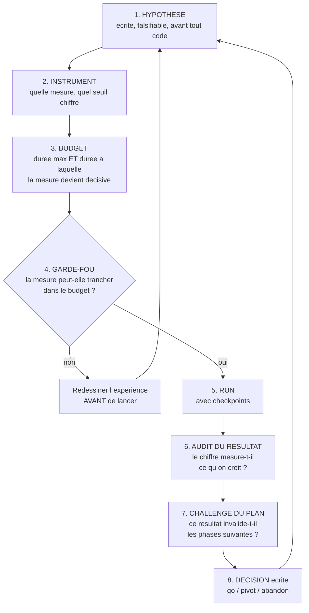

# Protocole expérimental — IA Courtisans à 3 joueurs

**Comment on construit l'IA, dans quel ordre, avec quels critères d'arrêt, et comment on décide après chaque itération.**

Cible : **3 joueurs**. Puis 2, puis 4.
Règles : [01_regles.md](01_regles.md). Moteur : [03_specification_moteur.md](03_specification_moteur.md).
Méthode d'audit : [07_protocole_audit_croise.md](07_protocole_audit_croise.md).

---

## 1. La contrainte qui détermine tout

**À 3 joueurs, il n'existe pas d'équilibre de Nash unique.** Les garanties de CFR valent pour
les jeux à deux joueurs et somme nulle. À 3 joueurs, le jeu reste à somme nulle, mais aucun
théorème ne dit vers quoi un algorithme converge.

**Conséquence : il n'y a pas de « solution » à atteindre.** On ne pourra jamais dire « cette
IA est à 0,002 de l'optimal ». On dira « cette IA bat celle-ci, dans ces proportions, sur ce
nombre de parties ».

C'est un changement de nature, pas de degré. Toute la campagne précédente était pilotée par
l'exploitabilité — un nombre absolu. Ici, **le juge est relatif**.

### Le juge : parties appariées contre un pool

| Adversaire | Rôle |
|---|---|
| **Greedy PIMC** | l'agent le plus fort jamais mesuré du projet. Le battre est le **plancher**, pas l'objectif. |
| **Aléatoire légal** | plancher absolu, détecte les régressions grossières |
| **Versions antérieures de l'IA** | mesure le progrès réel entre itérations |

**Parties appariées** : la même donne est rejouée avec les agents permutés à chaque position.
Ça supprime la variance de distribution, qui est énorme dans ce jeu, et divise par cinq à dix
le nombre de parties nécessaires pour conclure.

### La mesure secondaire : les comportements B1 à B7

Le winrate ne dit pas si l'IA a compris le jeu. Les sept comportements du §7.2 de
[01_regles.md](01_regles.md) le disent — en particulier **B1** (planifier un retournement) et
**B3** (fabriquer une alliance). Une IA qui bat le greedy sans jamais les manifester n'est
qu'un greedy légèrement meilleur.

**Chaque phase rapporte le winrate ET la fréquence des comportements.**

---

## 2. La boucle d'investigation

**Aucune expérience n'est lancée hors de cette boucle.**

### Quatre règles non négociables

**1. L'hypothèse s'écrit avant l'expérience.** Une phrase falsifiable, avec le résultat
attendu si elle est vraie et si elle est fausse. Pas d'expérience « pour voir ».

**2. Pas de tunnel.** Avant de lancer, on écrit à quelle **durée** la mesure devient
décisive. Si on ne sait pas le dire, l'expérience est mal conçue : on la redessine.
Plafond en phase exploratoire : **4 h par run**, checkpoint toutes les 15 minutes.

**3. Le résultat est audité avant d'être cru.** Trois questions : la mesure mesure-t-elle ce
qu'on croit ? sur quel support est-elle définie ? est-elle comparable à celle de l'expérience
précédente ? *C'est cette étape qui manquait à la campagne précédente : un plafond
d'exploitabilité a piloté trois mois de travail alors qu'il jouait au hasard sur un tiers du
jeu.*

**4. Le plan est challengé à chaque tour.** Un résultat peut rendre les phases suivantes
caduques. On le dit et on réécrit le plan.

### Chaque phase = deux conversations

Une pour construire, une pour auditer, l'auditeur ne voyant jamais le raisonnement du
constructeur ([07_protocole_audit_croise.md](07_protocole_audit_croise.md)).

---

## 3. Les phases

### Phase 0 — Le moteur conforme

**Objectif.** Que le code implémente les règles à 3 joueurs. Rien d'autre ne compte tant que
ce n'est pas vrai.

**Hypothèse.** Aucune — c'est de la construction, pas une expérience.

**Contenu.** Tests de conformité du §9 des règles écrits **en premier**, tous rouges, puis le
moteur jusqu'à ce qu'ils passent. Invariants du §5 de la spec moteur. Adaptateur OpenSpiel.

**Go/no-go.** Tous les tests de conformité et tous les invariants verts, pour `n ∈ {2, 3, 4}`.
Aucune exception.

**Rapport attendu.** Nombre de tests par catégorie, commande pour les rejouer, et pour chaque
échec la ligne fautive.

**Exécution machine.** Moins d'une minute.

---

### Phase 1 — L'instance d'entraînement

**Objectif.** Une configuration réduite qui garde la substance du jeu, et sur laquelle une
partie complète se joue vite.

**Hypothèse.** Une instance à 4 familles conserve les mécanismes qui font le jeu :
retournement, alliances par famille, information cachée.

**La contrainte de conception, énoncée par l'auteur.** Il faut **strictement plus de familles
que de joueurs**. Avec autant de familles que de joueurs, chacun se replie sur sa propre
famille pour ne pas perdre de points, personne ne prend le risque d'en attaquer une autre, et
**aucune stratégie d'alliance n'émerge**. Le jeu dégénère. Avec 6 familles pour 4 joueurs au
maximum, le jeu complet respecte cette contrainte avec de la marge.

**Configuration proposée, à valider :**

| Paramètre | Valeur | Raison |
|---|---|---|
| Familles | **4** | > 3 joueurs, marge minimale pour que les alliances existent |
| Rôles | les 5 | aucun mécanisme retiré |
| Exemplaires | 1 | 20 cartes |
| Joueurs | 3 | la cible |
| Tours | 2 par joueur | `floor(20 / 9)` |

**Le plancher de 3 tours du §8 des règles n'est pas atteint** avec cette configuration.
Alternative à 2 exemplaires : 40 cartes, **4 tours par joueur**, 4 cartes non piochées. Plus
lent mais conforme.

> **À trancher en phase 1** : 20 cartes et 2 tours, ou 40 cartes et 4 tours. Le critère est
> qu'un retournement doit être réalisable — il faut au moins deux poses au banquet par
> famille contestée.

**Go/no-go.** L'instance passe tous les tests de conformité. Sur 1 000 parties aléatoires :
les trois joueurs jouent le même nombre de tours, la distribution des scores n'est pas
dégénérée, et **au moins un retournement de famille survient dans une partie sur trois**.

**Rapport attendu.** Statistiques de 1 000 parties aléatoires : durée, distribution des
scores finaux, fréquence des retournements, fréquence des situations où refuser de tuer est
possible.

**Exécution machine.** Quelques minutes.

---

### Phase 2 — Mesurer le jeu avant d'y jouer

**Objectif.** Savoir à quoi ressemble le terrain, avant d'entraîner quoi que ce soit. C'est
la phase que la campagne précédente n'a jamais faite, et c'est pour ça qu'elle a interprété
de travers tous ses résultats.

**Hypothèse.** La position de départ n'avantage aucun joueur de façon décisive.

**Instrument.** 10 000 parties appariées entre trois agents aléatoires.
**Seuil** : si un siège gagne plus de **38 %** des parties (contre 33,3 % attendu), l'avantage
de position est structurel et **doit être neutralisé** dans toutes les mesures ultérieures par
permutation systématique des sièges.

**Trois autres mesures à établir, qui serviront de référence pour toujours :**

| Mesure | Pourquoi |
|---|---|
| Variance du score final entre parties | dimensionne le nombre de parties nécessaires pour conclure quoi que ce soit |
| Winrate du greedy contre l'aléatoire | fixe l'échelle : si le greedy est à 60 %, un agent à 65 % n'est pas impressionnant |
| Fréquence de chaque comportement B1–B7 chez le greedy | **la ligne de base des comportements** — sans elle, « l'IA planifie des retournements » n'est pas interprétable |

**Go/no-go.** Les quatre mesures sont établies et consignées au journal. Cette phase ne peut
pas échouer : elle produit des faits.

**Exécution machine.** Environ une heure.

---

### Phase 3 — Le premier agent

**Objectif.** Un agent entraîné qui bat le greedy.

**Choix d'algorithme, et pourquoi.**

*Problème* : entraîner une IA sur un jeu à 3 joueurs, somme nulle, information imparfaite,
crédit temporel long — le signe des points ne se décide qu'au décompte.

*Options* : (a) CFR / Deep CFR ; (b) apprentissage par renforcement en self-play ;
(c) méthode de population — PSRO, ligue.

*Choix* : **(b) self-play, avec un pool d'adversaires figés.**

*Justification contrastive* : (a) n'a **aucune garantie** au-delà de deux joueurs — on
paierait la complexité de CFR sans obtenir son théorème, et c'est la trajectoire qui a coûté
trois mois. (c) est la bonne réponse à terme, mais c'est (b) plus une couche de gestion de
population : on ne construit pas la couche avant d'avoir un agent qui apprend. (b) est le
plus court chemin vers un agent mesurable, et il se transforme en (c) en ajoutant le pool.

*Limite assumée* : le self-play pur peut tourner en rond — trois copies du même agent
développent une convention stable qui s'effondre contre un adversaire différent. **Le pool
figé est le garde-fou** : on mesure toujours contre le greedy et contre les versions
antérieures, jamais seulement contre soi-même.

**Ce que l'agent voit.** L'état décrit au §4.2 de
[03_specification_moteur.md](03_specification_moteur.md) : matrice par famille, agrégats
rendant calculable le raisonnement de marge, tête pointeur pour le ciblage.

**Hypothèse.** Un agent entraîné en self-play sur l'instance réduite bat le greedy PIMC.

**Instrument.** Winrate en parties appariées, sièges permutés.
**Seuil : > 55 % contre le greedy sur 1 000 parties appariées.** Décisif dès 300 parties si
l'écart dépasse 10 points.

**Garde-fou de la règle 2.** Si après 2 h d'entraînement le winrate contre l'aléatoire n'a pas
dépassé celui du greedy, on arrête : l'agent n'apprend pas, et rallonger ne dira rien de plus.

**Go/no-go.**

| Résultat | Conclusion | Suite |
|---|---|---|
| > 55 % contre le greedy | l'agent apprend | Phase 4 |
| 45–55 % | l'agent apprend mal | diagnostiquer avant d'insister : encodage, signal, budget |
| < 45 % contre l'aléatoire | bug | revenir à la phase 0 |

**Rapport attendu.** Winrate contre chaque membre du pool, avec intervalles de confiance. Et
**la fréquence des comportements B1 à B7, comparée à la ligne de base du greedy établie en
phase 2**.

**Exécution machine.** ~2 h d'entraînement, ~1 h de mesure.

---

### Phase 4 — Itérer

**Objectif.** Faire progresser l'agent, une variable à la fois.

**Chaque itération est un tour complet de la boucle du §2.** Une hypothèse, un changement,
une mesure, un audit, une décision écrite au journal.

**Leviers, dans l'ordre de coût croissant :**

| # | Levier | Hypothèse associée |
|---|---|---|
| 1 | Budget d'entraînement | l'agent n'a pas convergé, il lui faut plus de parties |
| 2 | Taille du réseau | l'agent ne peut pas représenter la stratégie |
| 3 | Architecture équivariante par famille | le réseau réapprend six fois la même fonction |
| 4 | Pool d'adversaires élargi — vers PSRO | l'agent a trouvé une convention de self-play, pas une stratégie |
| 5 | Signal auxiliaire pendant l'entraînement | le gain catégoriel est trop pauvre, l'apprentissage stagne |

**Règle d'or : une variable à la fois.** Deux changements simultanés produisent un résultat
non attribuable. C'est la règle qui a permis de diagnostiquer les briques de la campagne
précédente, et la seule à avoir survécu à l'audit.

**Go/no-go d'une itération.** Le winrate contre la version précédente dépasse **55 %** en
parties appariées. Sinon, le levier est écarté et documenté comme tel — un levier écarté est
un résultat, pas un échec.

**Condition d'arrêt de la phase.** Trois itérations consécutives sans gain : on ne cherche
plus des leviers, on remet en cause l'approche.

---

### Phase 5 — Le jeu complet

**Objectif.** Passer de l'instance réduite aux 90 cartes, 3 joueurs, 10 tours chacun.

**Hypothèse.** L'agent entraîné sur l'instance réduite transfère, ou se ré-entraîne sans
changement de méthode.

**Ce qui change et qu'il faut mesurer :** 6 familles au lieu de 4, 10 tours au lieu de 2 ou 4,
un crédit temporel bien plus long, et un espace d'états sans commune mesure.

**Instrument.** Winrate contre le greedy sur le jeu complet.
**Seuil : > 55 %** sur 1 000 parties appariées.

**Point de vigilance.** Si l'agent réduit transfère mal, la question n'est pas « comment
mieux transférer » mais « qu'est-ce que l'instance réduite ne contenait pas ». C'est une
information sur le jeu, à consigner au journal.

---

### Phase 6 — 2 et 4 joueurs

À 2 joueurs, CFR retrouve ses garanties et l'exploitabilité redevient calculable : c'est
l'occasion de **vérifier a posteriori** que la machinerie — encodage, réseau, boucle — est
saine, avec un nombre absolu. À 4 joueurs, même méthode qu'à 3.

À n'ouvrir qu'une fois la phase 5 close.

---

## 4. Récapitulatif

| Phase | Objet | Juge | Seuil | Exécution |
|---|---|---|---|---|
| 0 | Moteur conforme | tests | 100 % verts | < 1 min |
| 1 | Instance d'entraînement | tests + statistiques | retournement dans 1 partie sur 3 | quelques min |
| 2 | Mesurer le jeu | 10 000 parties aléatoires | avantage de siège < 38 % | ~1 h |
| 3 | Premier agent | greedy, parties appariées | **> 55 %** | ~3 h |
| 4 | Itérations | version précédente | **> 55 %** par itération | ~3 h chacune |
| 5 | Jeu complet | greedy | **> 55 %** | à établir |
| 6 | 2 et 4 joueurs | exploitabilité à 2 joueurs | à établir | à établir |

Ces durées sont des **temps d'exécution machine**. Aucune estimation de temps de
développement n'est donnée : elles ne seraient pas fondées.

---

## 5. Ce que ce protocole ne couvre pas

- **Il n'y a pas de vérité-terrain absolue à 3 joueurs.** Tous les seuils sont relatifs à un
  pool. Si le pool est faible, un agent peut sembler fort sans l'être. C'est pourquoi le
  greedy y reste en permanence : c'est le seul membre du pool dont la force est connue et
  indépendante de l'entraînement.
- **Les comportements B1 à B7 sont mesurés par des heuristiques**, pas par une définition
  formelle. Deux mesures du même comportement peuvent diverger. Les définitions exactes sont
  à écrire en phase 2, avec la ligne de base du greedy.
- **Le passage à PSRO n'est pas spécifié.** Il est nommé comme levier 4 de la phase 4 ;
  s'il devient nécessaire, il fera l'objet de sa propre spécification.
- **Rien n'est prévu pour l'interface.** Brancher l'agent dans l'application est un travail
  distinct, à faire une fois la phase 5 close.
