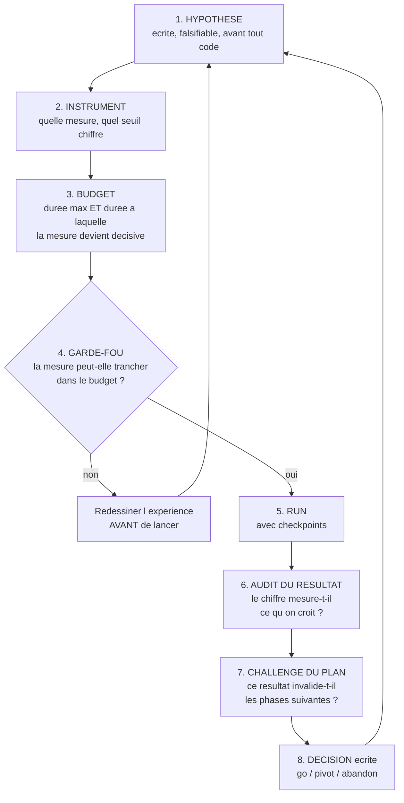

# Protocole expérimental — IA Courtisans à 3 joueurs

**Comment on construit l'IA, dans quel ordre, avec quels critères d'arrêt, et comment on décide après chaque itération.**

Cible : **3 joueurs**. Puis 2, puis 4.
Règles : [01_regles.md](01_regles.md). Moteur : [03_specification_moteur.md](03_specification_moteur.md).
Méthode d'audit : [07_protocole_audit_croise.md](07_protocole_audit_croise.md).

---

## 0. Comment un chiffre s'écrit, et comment une décision se consigne

**Cette section est normative, et elle vaut pour la construction comme pour l'audit.** Elle est
écrite le 20/08/2026, après les phases 0, 1 et 2. Chacune de ses règles vient d'une faute
réelle, commise dans ce projet et consignée au [journal](06_journal_decisions.md) — pas d'un
principe général. Le [journal](06_journal_decisions.md) y renvoyait déjà ; la section, elle,
n'existait pas.

### 0.1 Le format d'une entrée de journal

Une entrée par tour de boucle d'investigation. Antichronologique, le plus récent en haut.

```
[date] Phase X.Y — <titre>
Hypothèse   : énoncé falsifiable, écrit AVANT l'expérience
Instrument  : métrique, seuil chiffré, durée à laquelle elle devient décisive
Résultat    : ce qu'on a mesuré
Audit       : le chiffre mesure-t-il ce qu'on croit ? sur quel support ? comparable ?
Décision    : go / pivot / abandon — avec justification
Impact plan : phases invalidées ou modifiées
```

### 0.2 Les règles d'écriture d'un chiffre

*Cette liste n'annonce pas son nombre, et c'est délibéré : la règle **« un compte n'est pas une
liste de noms »** ci-dessous est sortie cinq fois en phase 2, dont une dans le texte qui la
nommait quatre fois.*

- **Tout chiffre porte son échantillon.** Seeds, politique, **composition de la population**,
  grain, dénominateur. Un chiffre sans son échantillon n'est pas auditable, même s'il est juste.
- **Un chiffre exact se donne sur une population que sa phrase nomme.** C'est la faute la plus
  fréquente du projet : un nombre juste, reproductible au bit près, dont la phrase parle d'une
  population qui n'est pas celle du calcul.
- **Un taux dont le sujet grammatical n'est pas l'unité comptée publie son dénominateur.**
  « 5 retournements invisibles sur 2 075 familles en R2 » et « 5 sur 4 000 emplacements
  famille × partie » sont deux réponses justes à deux questions différentes.
- **Un compte n'est pas une liste de noms.** Écrire les noms. « Trois compteurs de B4 » en
  concernait quatre ; « vérifiée sur les deux colonnes » n'en couvrait plus deux depuis qu'il y
  en avait trois.
- **Un zéro absolu se confronte à un cas construit à la main avant d'être écrit.** Le zéro de la
  phase 1 était contredit par un test du même livrable.
- **L'unité se reconstruit avant la valeur, et séparément.** Reproduire un nombre ne le valide
  pas : deux implémentations qui partagent la même hypothèse fausse concordent parfaitement.
  Un facteur trois indu a survécu à deux vérifications réussies pour cette raison. Le contrôle
  A7 — « les chiffres se reconstruisent » — **ne remplace pas** le contrôle 1 — « le calcul est
  celui que la phrase décrit ».
- **Un taux ne se compare qu'à la valeur nulle de sa propre composition.** À trois joueurs, la
  part de victoire fractionnée vaut **33,33 %** au neutre, **jamais 50 %**. Trois niveaux neutres
  coexistent et ne sont pas interchangeables : 0,0000 pour le gain moyen, 33,33 % pour la part
  fractionnée, `(1 − P(trois ex æquo))/3` pour la part stricte — cette dernière dépendant de la
  fréquence des ex æquo, elle **ne peut pas servir de seuil**.
- **Deux lignes ne se comparent qu'au même grain.** Le grain porte le **nombre de sièges
  agrégés**. Dans le code de mesure, `ecart_de_taux` et `cumuler` **lèvent** quand les grains
  diffèrent, plutôt que de rendre un nombre qu'il faudrait relire.
- **Un facteur de gain d'échantillonnage se mesure sur la population qui l'utilise.** L'appariement
  ne divise le budget que d'un facteur qu'il faut avoir mesuré ; voir le §1.
- **Aucune durée ne se cite sur un seul chronométrage.** Sur la machine du projet, cinq passes du
  même code donnent un rapport max/min de **2,93 à 3,00** par campagne, **de façon non monotone**.
  Le temps mural mesure l'état de la machine, pas le coût du code. Toute durée se cite sur au
  moins **trois passes, avec son étendue**.
- **Une correction arrive avec ce qui l'empêche de se défaire.** Une exception levée, un invariant
  asserté, un site de calcul unique — pas une cellule réécrite. Le seul défaut trouvé deux fois au
  même endroit est celui qu'un tour antérieur avait corrigé sans parade.
- **On relit ce qui a été écrit en dernier, pas ce qui a été mesuré en premier.** La correction est
  le lieu du défaut suivant. Quatre fois de suite en phase 2, le défaut neuf est né dans le texte
  qui corrigeait le précédent.
- **Une affirmation porte MESURÉ, DÉDUIT ou SUPPOSÉ.** Un `SUPPOSÉ` dans un compte rendu est un
  test qui manque : en phase 0, le seul `SUPPOSÉ` écrit est devenu le défaut 9.

### 0.3 Ce qu'un agent de référence a le droit de devenir

**Un agent de référence se documente, il ne se corrige pas après publication.** L'incohérence
d'horizon du greedy — sa pose évaluée Assassins résolus conjointement, son ciblage myope — est
réelle, mesurée, et **décrite** au §4 bis du rapport de phase 2 plutôt que corrigée. La corriger
aurait déplacé l'étalon de toutes les phases qui l'ont déjà cité. Une ligne de base n'a pas
besoin d'être forte : elle a besoin d'être **exactement décrite**.

Conséquence pour les phases suivantes : **`agents/greedy.py` est la ligne de base de toutes les
phases et ne porte aucune mutation.** `outillage/mutation.py` ne cible que `courtisans/`.

---

## 1. La contrainte qui détermine tout

**À 3 joueurs, il n'existe pas d'équilibre de Nash unique.** Les garanties de CFR valent pour
les jeux à deux joueurs et somme nulle. À 3 joueurs, le jeu reste à somme nulle, mais aucun
théorème ne dit vers quoi un algorithme converge.

**Conséquence : il n'y a pas de « solution » à atteindre.** On ne pourra jamais dire « cette
IA est à 0,002 de l'optimal ». On dira « cette IA bat celle-ci, dans ces proportions, sur ce
nombre de parties ».

C'est un changement de nature, pas de degré. Toute la campagne précédente était pilotée par
l'exploitabilité — un nombre absolu. Ici, **le juge est relatif**.

### Le juge : parties appariées contre un pool

| Adversaire | Rôle |
|---|---|
| **Greedy PIMC** | l'agent le plus fort jamais mesuré du projet. Le battre est le **plancher**, pas l'objectif. |
| **Aléatoire légal** | plancher absolu, détecte les régressions grossières |
| **Versions antérieures de l'IA** | mesure le progrès réel entre itérations |

**Parties appariées** : la même donne est rejouée avec les agents permutés à chaque position.
Ça supprime la variance de distribution, qui est énorme dans ce jeu.

> **Corrigé le 20/08/2026.** Ce paragraphe affirmait que l'appariement « divise par cinq à dix le
> nombre de parties nécessaires pour conclure ». **Cette affirmation était publiée sans aucune
> mesure d'appui, et la phase 2 l'a infirmée sur la seule population où le facteur a été
> mesuré.** La corrélation intra-donne des gains sous jeu **uniformément aléatoire** vaut
> **ρ = +0,0066 en moyenne sur les trois sièges** — ils valent +0,0123, +0,0007 et +0,0068 — sur
> les 10 002 parties de la campagne A, soit un facteur de gain de **1,01** : l'appariement n'y
> économise rien du tout. L'affirmation « cinq à dix » impliquait un ρ entre **0,80 et 0,90**.
>
> Le facteur **sous jeu greedy et sous agents entraînés n'est pas mesuré**. Ni cinq à dix, ni un :
> tant que personne ne l'a mesuré sur la population concernée, il n'y a pas de chiffre. Écrire
> « l'appariement ne sert à rien » à partir du ρ ci-dessus serait exactement la faute qu'on vient
> de corriger — un chiffre exact sur une population que la phrase ne nomme pas.
>
> **L'appariement reste obligatoire** : il ne coûte rien et il supprime une variance réelle.
> Ce qui est interdit, c'est de **dimensionner un budget** sur un facteur de gain qu'on n'a pas
> mesuré sur sa propre population. Toute phase qui veut s'en servir mesure d'abord son ρ.
>
> **Et la phase 3 a fourni le contre-exemple, le 21/08/2026 : il existe un appariement qui
> économise vraiment.** Ce ρ-ci n'est pas le même objet que celui ci-dessus — celui de la phase 2
> est mesuré entre **réplicats de politique** sur une donne, celui de la phase 3 entre
> **assignations de siège** sur une donne. Mesuré sur « un greedy contre deux greedys »,
> 2 000 donnes, seeds 20000–21999 : **ρ = −0,1400**, effet de plan **0,7200** — la permutation des
> sièges **fait gagner 28 % de variance**. Elle est négative *par structure* : la somme des trois
> sièges vaut zéro dans une partie, donc ce qu'un siège gagne, les autres le perdent.
> **Conséquence : « l'appariement n'économise rien » est vrai du ρ de la phase 2 et faux de
> celui-là. Nommer lequel des deux on parle fait partie du chiffre.**

### La mesure secondaire : les comportements B1 à B7

Le winrate ne dit pas si l'IA a compris le jeu. Les sept comportements du §7.2 de
[01_regles.md](01_regles.md) le disent — en particulier **B1** (planifier un retournement) et
**B3** (fabriquer une alliance). Une IA qui bat le greedy sans jamais les manifester n'est
qu'un greedy légèrement meilleur.

**Chaque phase rapporte le winrate ET la fréquence des comportements.**

---

## 2. La boucle d'investigation

**Aucune expérience n'est lancée hors de cette boucle.**



### Quatre règles non négociables

**1. L'hypothèse s'écrit avant l'expérience.** Une phrase falsifiable, avec le résultat
attendu si elle est vraie et si elle est fausse. Pas d'expérience « pour voir ».

**2. Pas de tunnel.** Avant de lancer, on écrit à quelle **durée** la mesure devient
décisive. Si on ne sait pas le dire, l'expérience est mal conçue : on la redessine.
Plafond en phase exploratoire : **4 h par run**, checkpoint toutes les 15 minutes.

**3. Le résultat est audité avant d'être cru.** Trois questions : la mesure mesure-t-elle ce
qu'on croit ? sur quel support est-elle définie ? est-elle comparable à celle de l'expérience
précédente ? *C'est cette étape qui manquait à la campagne précédente : un plafond
d'exploitabilité a piloté trois mois de travail alors qu'il jouait au hasard sur un tiers du
jeu.*

**4. Le plan est challengé à chaque tour.** Un résultat peut rendre les phases suivantes
caduques. On le dit et on réécrit le plan.

### Chaque phase = deux conversations

Une pour construire, une pour auditer, l'auditeur ne voyant jamais le raisonnement du
constructeur ([07_protocole_audit_croise.md](07_protocole_audit_croise.md)).

---

## 3. Les phases

### Phase 0 — Le moteur conforme

**Objectif.** Que le code implémente les règles à 3 joueurs. Rien d'autre ne compte tant que
ce n'est pas vrai.

**Hypothèse.** Aucune — c'est de la construction, pas une expérience.

**Contenu.** Tests de conformité du §9 des règles écrits **en premier**, tous rouges, puis le
moteur jusqu'à ce qu'ils passent. Invariants du §5 de la spec moteur. Adaptateur OpenSpiel.

**Go/no-go.** Tous les tests de conformité et tous les invariants verts, pour `n ∈ {2, 3, 4}`.
Aucune exception.

**Rapport attendu.** Nombre de tests par catégorie, commande pour les rejouer, et pour chaque
échec la ligne fautive.

**Exécution machine.** Moins d'une minute.

---

### Phase 1 — L'instance d'entraînement

**Objectif.** Une configuration réduite qui garde la substance du jeu, et sur laquelle une
partie complète se joue vite.

**Hypothèse.** Une instance à 4 familles conserve les mécanismes qui font le jeu :
retournement, alliances par famille, information cachée.

**La contrainte de conception, énoncée par l'auteur.** Il faut **strictement plus de familles
que de joueurs**. Avec autant de familles que de joueurs, chacun se replie sur sa propre
famille pour ne pas perdre de points, personne ne prend le risque d'en attaquer une autre, et
**aucune stratégie d'alliance n'émerge**. Le jeu dégénère. Avec 6 familles pour 4 joueurs au
maximum, le jeu complet respecte cette contrainte avec de la marge.

**Configuration proposée, à valider :**

| Paramètre | Valeur | Raison |
|---|---|---|
| Familles | **4** | > 3 joueurs, marge minimale pour que les alliances existent |
| Rôles | les 5 | aucun mécanisme retiré |
| Exemplaires | 1 | 20 cartes |
| Joueurs | 3 | la cible |
| Tours | 2 par joueur | `floor(20 / 9)` |

**Le plancher de 3 tours du §8 des règles n'est pas atteint** avec cette configuration.
Alternative à 2 exemplaires : 40 cartes, **4 tours par joueur**, 4 cartes non piochées. Plus
lent mais conforme.

> **À trancher en phase 1** : 20 cartes et 2 tours, ou 40 cartes et 4 tours. Le critère est
> qu'un retournement doit être réalisable — il faut au moins deux poses au banquet par
> famille contestée.

**Go/no-go.** L'instance passe tous les tests de conformité. Sur 1 000 parties aléatoires :
les trois joueurs jouent le même nombre de tours, la distribution des scores n'est pas
dégénérée, et **au moins un retournement de famille survient dans une partie sur trois**.

**Rapport attendu.** Statistiques de 1 000 parties aléatoires : durée, distribution des
scores finaux, fréquence des retournements, fréquence des situations où refuser de tuer est
possible.

**Exécution machine.** Quelques minutes.

> **Erratum du 20/08/2026 — trois termes chiffrés qui n'étaient définis nulle part, et un
> arbitrage qui n'en était pas un.** Le go/no-go ci-dessus est celui contre lequel la phase 1 a
> été jouée : il n'est pas réécrit. Mais trois de ses termes portaient un seuil chiffré sans être
> définis. Les définitions ci-dessous ont été proposées par le constructeur **avant la mesure**,
> ont tenu **deux tours d'audit**, et sont désormais celles du protocole.
>
> **« Retournement » = R2, la perte d'acquis.** Sur la suite des statuts d'une famille :
> `∃ t : s_{t−1} ≠ Indifférente et s_t ≠ s_{t−1}`. Une **partie** satisfait R2 si **au moins une**
> de ses familles la satisfait. R2 plutôt que l'inversion de signe parce que l'encadré du §2.2 des
> règles tranche déjà : **le seuil qui compte est l'Indifférence, pas l'Obscurité.** Trois
> définitions concurrentes sont **rapportées à côté** et ne servent pas de critère — R0 toute
> transition, R1 inversion de signe, R3 divergence finale — parce que le chiffre change avec la
> définition et qu'un lecteur doit voir de combien. R0 est inutilisable comme critère et n'est
> rapportée que pour le montrer : la première carte posée au banquet dans une famille est déjà une
> transition.
>
> **« Distribution non dégénérée » = quatre critères, sur les scores finaux examinés par siège.**
> D1 : écart-type ≥ **1 point**, le plus petit quantum marquable. D2 : au moins **8** valeurs de
> score distinctes. D3 : part de la valeur modale < **50 %**. D4 : part des parties à trois
> ex æquo < **50 %**, le gain valant `0, 0, 0` sur une telle partie.
>
> **« Situations où refuser de tuer est possible » = les nœuds de phase CIBLAGE où
> `len(legal_actions()) ≥ 2`**, c'est-à-dire au moins une cible valide **en plus** du refus. La
> lecture littérale du terme est **vide** : refuser est toujours légal (§4.1 des règles, arbitrage
> R2), donc la fréquence vaudrait 100 % par construction et ne dirait rien.
>
> **Les quatre critères D1–D4 ne discriminent presque rien, et il faut le savoir avant de les
> réutiliser.** Mesuré en phase 1 : D2 est franchi dès **12** parties, D1 et D3 dès **3**, D4 dès
> **1**. Ils écartent une distribution constante, pas une distribution pauvre. Toute phase qui les
> reprend — la phase 5 valide une nouvelle instance — doit mesurer leur pouvoir discriminant avant
> de s'en servir, et non après.
>
> **Et l'arbitrage qui n'en était pas un.** L'encadré « à trancher en phase 1 : 20 cartes et
> 2 tours, ou 40 cartes et 4 tours » ne présentait aucun choix : la variante à 20 cartes est
> **refusée à la construction** par le plancher `tours ≥ 3` du §8 des règles. Il n'y avait rien à
> trancher, et l'instance retenue est `entrainement-3j` — 4 familles, 5 rôles, 2 exemplaires,
> 3 joueurs, 40 cartes, 4 tours.

---

### Phase 2 — Mesurer le jeu avant d'y jouer

**Objectif.** Savoir à quoi ressemble le terrain, avant d'entraîner quoi que ce soit. C'est
la phase que la campagne précédente n'a jamais faite, et c'est pour ça qu'elle a interprété
de travers tous ses résultats.

**Hypothèse.** La position de départ n'avantage aucun joueur de façon décisive.

**Instrument.** 10 000 parties appariées entre trois agents aléatoires.
**Seuil** : si un siège gagne plus de **38 %** des parties (contre 33,3 % attendu), l'avantage
de position est structurel et **doit être neutralisé** dans toutes les mesures ultérieures par
permutation systématique des sièges.

**Trois autres mesures à établir, qui serviront de référence pour toujours :**

| Mesure | Pourquoi |
|---|---|
| Variance du score final entre parties | dimensionne le nombre de parties nécessaires pour conclure quoi que ce soit |
| Winrate du greedy contre l'aléatoire | fixe l'échelle : si le greedy est à 60 %, un agent à 65 % n'est pas impressionnant |
| Fréquence de chaque comportement B1–B7 chez le greedy | **la ligne de base des comportements** — sans elle, « l'IA planifie des retournements » n'est pas interprétable |

**Go/no-go.** Les quatre mesures sont établies et consignées au journal. Cette phase ne peut
pas échouer : elle produit des faits.

**Exécution machine.** Environ une heure.

> **Erratum du 20/08/2026 — cinq défauts de ce texte, relevés par la phase 2 elle-même.** Le
> go/no-go ci-dessus est celui contre lequel la phase 2 a été jouée : il n'est pas réécrit.
>
> **1. Le seuil de 38 % ne dit pas ce qu'est « gagner ».** Les règles conservent les égalités, et
> plusieurs lectures de « gagner » coexistent, **dont les valeurs nulles diffèrent** — voir la
> règle du §0.2. Sous la lecture la plus littérale, « être au score maximum, **ex æquo compris** »,
> les trois sièges de la campagne à trois aléatoires de l'auditeur, 10 000 parties, valent
> **38,47 %, 38,16 % et 38,90 %**. Le seuil se franchit donc **pour les trois sièges à la fois,
> avec un avantage de siège nul**. Un seuil que tout le monde franchit sans avantage n'est pas un
> test d'avantage de siège. Le chiffre du rapport, **33,50 %**, est la part de victoire
> **fractionnée** du siège le plus favorisé de la campagne A du constructeur, 10 002 parties —
> une autre lecture, une autre valeur nulle, et c'est celle qui a servi.
>
> **2. Le seuil de 38 % ne discrimine rien au budget annoncé.** Mesuré : il est à **9,9
> erreurs-type** de la valeur nulle à n = 10 002, et ne devient un test à 5 % qu'à **n = 392**.
> Un seuil qui ne peut pas être franchi par le hasard ne teste rien ; il faut le vérifier
> **avant** de lancer, c'est l'étape 4 de la boucle du §2.
>
> **3. « La variance du score final » ne nomme pas son unité.** Celle qui dimensionne une
> comparaison entre agents est la variance du **gain**, pas du score. Les deux, mesurées sous jeu
> uniformément aléatoire sur la campagne A : σ(score) = **4,412**, σ(gain) = **0,6652**.
>
> **4. « Si le greedy est à 60 % » ne dit ni contre quoi il joue, ni à quoi le 60 % se compare.**
> À trois joueurs le point de comparaison est **33,33 %**, jamais 50 %. Mesuré : **un** greedy
> contre **deux** aléatoires est à **86,52 %** de part de victoire fractionnée, pour un gain moyen
> de **+0,7978**.
>
> **5. « Cette phase ne peut pas échouer » est faux.** C'est vrai de son go/no-go et faux de tout
> le reste, et c'est exactement l'inverse qui est dangereux : la phase 2 produit les lignes de base
> que **toutes les phases suivantes citeront sans les rejouer**. Un chiffre faux y survit à chaque
> phase qui le cite. Les faits : la phase 2 a été **REJETÉE** au premier tour d'audit sur un défaut
> bloquant, il a fallu **trois tours** et **75 contrôles hostiles**, et un **cinquième** défaut a
> été trouvé après le deuxième verdict.

**Ce que la phase 2 a effectivement établi**, et à quelles conditions les phases suivantes ont le
droit de le citer :

- **Le seuil de siège n'est pas franchi** au sens qui a servi — 33,50 % de part fractionnée pour
  le siège le plus favorisé, +0,35 σ de l'attendu. **La permutation systématique des sièges est
  malgré tout obligatoire et inconditionnelle**, non parce que M1 la déclenche — il ne la
  déclenche pas — mais parce que l'avantage de siège est **négligeable sous jeu aléatoire et
  massif sous jeu greedy** : contraste apparié entre sièges extrêmes **+0,1890**, IC 99 %
  [+0,1588 ; +0,2196].
- **B1 et B3 mesurent chez le greedy la fréquence à laquelle le motif apparaît par coïncidence,
  jamais une planification.** Aucune phase n'a le droit d'écrire que le greedy « planifie ».
- **B1 est plafonné** par les **7,40 %** de parties portant une perte d'acquis qu'aucun siège ne
  pouvait voir, mesurés en phase 1.
- **19 des 34 lignes de M4 sont hors du budget de la phase 3**, et **B7 n'y peut rien séparer du
  tout** : son écart détectable dépasse son propre taux.
- **`B4-tout-dos` et `B5-renfort` ne sont pas comparables entre compositions.** Leurs taux publiés,
  **3,89 %** et **20,41 %**, bougeront sous trois agents entraînés pour une raison qui n'est pas
  l'habileté de l'agent. Le critère de périmètre se décide **sur le texte de la définition** :
  nomme-t-elle un autre joueur ? `B1-collectif` oui, ces deux-là non.
- **La ligne de base collective de `B1-collectif` est celle des trois greedys**, pas celle d'un
  greedy contre deux hasards.

---

### Phase 3 — Le premier agent

**Objectif.** Un agent entraîné qui bat le greedy.

**Choix d'algorithme, et pourquoi.**

*Problème* : entraîner une IA sur un jeu à 3 joueurs, somme nulle, information imparfaite,
crédit temporel long — le signe des points ne se décide qu'au décompte.

*Options* : (a) CFR / Deep CFR ; (b) apprentissage par renforcement en self-play ;
(c) méthode de population — PSRO, ligue.

*Choix* : **(b) self-play, avec un pool d'adversaires figés.**

*Justification contrastive* : (a) n'a **aucune garantie** au-delà de deux joueurs — on
paierait la complexité de CFR sans obtenir son théorème, et c'est la trajectoire qui a coûté
trois mois. (c) est la bonne réponse à terme, mais c'est (b) plus une couche de gestion de
population : on ne construit pas la couche avant d'avoir un agent qui apprend. (b) est le
plus court chemin vers un agent mesurable, et il se transforme en (c) en ajoutant le pool.

*Limite assumée* : le self-play pur peut tourner en rond — trois copies du même agent
développent une convention stable qui s'effondre contre un adversaire différent. **Le pool
figé est le garde-fou** : on mesure toujours contre le greedy et contre les versions
antérieures, jamais seulement contre soi-même.

**Ce que l'agent voit.** L'état décrit au §4.2 de
[03_specification_moteur.md](03_specification_moteur.md) : matrice par famille, agrégats
rendant calculable le raisonnement de marge, tête pointeur pour le ciblage.

**Hypothèse.** Un agent entraîné en self-play sur l'instance réduite bat le greedy PIMC.

> **Réécrit le 20/08/2026, avant que la phase ne soit ouverte.** Le seuil de cette phase était
> **« > 55 % contre le greedy »**, avec une bande 45–55 % et un plancher à 45 %. **Ces trois
> nombres sont des intuitions de jeu à deux joueurs.** À trois joueurs, la part de victoire
> fractionnée vaut **33,33 %** au neutre : un agent à 45 % n'est pas « en dessous du hasard », il
> est très au-dessus. Le texte ne nommait par ailleurs **ni la composition** de la population, ni
> l'unité du taux. Le seuil ci-dessous le remplace. L'ancien est laissé écrit plutôt qu'effacé
> pour que le changement soit visible — **la phase 3 n'a jamais été jouée contre lui**, donc rien
> ici ne protège une pré-inscription : c'est de la traçabilité, pas un erratum.

**Composition mesurée.** **Un agent contre deux greedys**, sièges permutés systématiquement — la
permutation est obligatoire, voir l'erratum de la phase 2. Un agent contre deux aléatoires est
mesuré en parallèle, pour le garde-fou seul.

**Instrument.** Le juge est le **gain moyen**, dont la valeur nulle est exactement **0,0000** et
ne dépend d'aucune fréquence d'ex æquo. La part de victoire fractionnée est rapportée à côté,
comparée à **33,33 %** ; la part de victoire stricte n'est pas un seuil, sa valeur nulle
dépendant de la fréquence des ex æquo.

**Seuil.** L'agent bat le greedy si son **gain moyen contre deux greedys est strictement positif,
borne basse d'un intervalle de confiance à 99 % comprise**, bootstrap **par donne** comme en
phase 2.

**Le budget se dimensionne avant de lancer, et pas sur un chiffre emprunté.** Le seul écart de
gain détectable mesuré à ce jour, **+0,1013 à 1 000 parties appariées**, l'a été **sous jeu
uniformément aléatoire**, avec σ(gain) = 0,6652 et ρ = +0,0066 moyenné sur trois sièges.
**Rien ne dit qu'il vaut sous une
population d'un agent contre deux greedys.** La phase 3 mesure donc σ(gain) et ρ **sur sa propre
composition**, en pré-inscription, et en déduit son nombre de parties — c'est l'étape 4 de la
boucle du §2, et le §0.2 l'exige.

**Garde-fou de la règle 2.** Il **teste la prémisse qu'il nomme**, et rien d'autre : *l'agent
n'apprend pas.* À chaque checkpoint de 15 minutes, l'agent est mis à la place du greedy dans la
composition **un contre deux aléatoires** et sa part de victoire fractionnée est mesurée, agrégée
sur les trois sièges. Il se déclenche si, sur **trois checkpoints consécutifs**, cette part n'a pas
progressé — intervalles à 99 % qui se recouvrent d'un checkpoint au suivant.

**Il ne se déclenche PAS parce que l'agent n'a pas atteint le niveau du greedy.** Les **86,52 %**
du greedy dans cette composition sont la **cible** de la phase, pas un test d'apprentissage. Un
agent peut apprendre franchement sans les atteindre, et c'est exactement ce qui est arrivé.

> **Troisième correction de ce même garde-fou, le 21/08/2026.** Il en a porté trois défauts
> successifs, et les trois étaient des confusions différentes. **Un :** le texte d'origine écrivait
> « si après 2 h d'entraînement », dans une section dont le plafond est 2 h — il se déclenchait
> quand le run était fini. **Deux :** la correction du pilote l'évaluait à chaque checkpoint, donc
> il se déclenchait au premier, avant que quoi que ce soit ait pu être appris. **Trois :** sa
> prémisse était fausse. Il concluait « l'agent n'apprend pas » d'un agent qui n'atteignait pas le
> greedy, et la phase 3 fournit le contre-exemple mesuré — part fractionnée contre deux aléatoires
> **57,33 → 59,52 → 61,77 → 63,22 → 65,06 → 67,56 → 69,27 → 70,13 %**, croissance monotone sans
> exception sur huit checkpoints, encore en progression au dernier, et pourtant loin des 86,52 %.
>
> **Un garde-fou doit tester la phrase qu'il écrit.** Les trois défauts venaient de ce qu'il n'en
> testait pas une seule.

> **Corrigé le 20/08/2026, sur remontée de la conversation n° 6.** Ce garde-fou disait « **si après
> 2 h d'entraînement** », dans une section dont le plafond d'exécution est **2 h**. Il se
> déclenchait donc exactement au moment où le run était fini, et **n'arrêtait jamais rien** — un
> garde-fou qui ne garde de rien. Le défaut venait du texte d'origine ; le pilote l'a recopié en
> réécrivant cette phase, et a même posé le plafond de 2 h trois paragraphes plus bas sans voir la
> contradiction. C'est la règle du §0.2 appliquée à qui l'a écrite : **on relit ce qui a été écrit
> en dernier.** La comparaison est licite parce que la
composition est **identique** et que seul l'agent au siège mesuré change.

> **Ce 86,52 % est une moyenne sur les trois sièges**, agrégée sur les 10 002 parties de la
> campagne B, et il ne se compare qu'à une mesure agrégée de la même façon. Ce n'est pas une
> précaution de forme : **l'avantage de siège est massif sous jeu greedy** — les gains par siège
> valent 0,697, 0,812 et 0,886 — et confronter un chiffre d'un seul siège à cette moyenne serait
> mot pour mot le défaut bloquant du tour 1 de la phase 2, une comparaison entre deux grains.

**Go/no-go.**

| Résultat, en gain moyen contre **deux greedys** | Conclusion | Suite |
|---|---|---|
| borne basse de l'IC 99 % **> 0** | l'agent bat le greedy | Phase 4 |
| IC 99 % **contenant 0** | non conclu au budget | dimensionner davantage, ou diagnostiquer : encodage, signal, budget |
| borne haute de l'IC 99 % **< 0** | l'agent est battu par le greedy | diagnostiquer avant d'insister |
| part fractionnée **< 33,33 %** contre **deux aléatoires**, IC 99 % excluant 33,33 % | bug | revenir à la phase 0 |

**Rapport attendu.** Gain moyen et part de victoire fractionnée contre chaque membre du pool,
**chacun avec sa composition nommée** et son intervalle de confiance à 99 %. Et **la fréquence des
comportements B1 à B7, comparée à la ligne de base du greedy établie en phase 2** — au **même
grain**, la garde levant si les grains diffèrent, et **sans citer `B4-tout-dos` ni `B5-renfort`
entre compositions différentes**.

**Quatre défauts mineurs hérités de la phase 2 se traitent au début de cette phase**, avant toute
mesure :

1. le rapport généré est écrit en **cp1252** quand les **cinq** autres documents de `mesure/`
   sont en UTF-8 — le relevé de la phase 2 écrivait « quatre », il y en a cinq ;
2. **`vue_du_joueur` ne valide pas son argument** et rend une vue n'appartenant à aucun siège —
   c'est la réouverture du défaut 2 de la phase 0 sur une entrée neuve, et c'est le plus sérieux
   des quatre puisque **tout agent en dépend** ;
3. deux des douze directions annoncées en phase 2 sont comptées comme tenues alors que la
   pré-inscription les déclare **nulles par construction** ;
4. une cellule « voir `B4-departage` » figure dans une table dont le texte dit qu'elle ne se lit
   qu'en juxtaposant deux nombres.

**Machine.** La phase 3 tourne sur le PC fixe — Ryzen 9600X, RTX 4060, 64 Go de RAM. La phase 2
n'utilisait aucun GPU.

**Exécution machine.** Plafond de **2 h** d'entraînement par run, checkpoint toutes les
15 minutes. Aucune durée mesurée n'est publiée sur un seul chronométrage : trois passes minimum,
avec l'étendue — voir le §0.2.

---

### Phase 4 — Itérer

**Objectif.** Faire progresser l'agent, une variable à la fois.

**Chaque itération est un tour complet de la boucle du §2.** Une hypothèse, un changement,
une mesure, un audit, une décision écrite au journal.

**Leviers, dans l'ordre de coût croissant :**

| # | Levier | Hypothèse associée |
|---|---|---|
| 1 | Budget d'entraînement | l'agent n'a pas convergé, il lui faut plus de parties |
| 2 | Taille du réseau | l'agent ne peut pas représenter la stratégie |
| 3 | Architecture équivariante par famille | le réseau réapprend six fois la même fonction |
| 4 | Pool d'adversaires élargi — vers PSRO | l'agent a trouvé une convention de self-play, pas une stratégie |
| 5 | Signal auxiliaire pendant l'entraînement | le gain catégoriel est trop pauvre, l'apprentissage stagne |

**Règle d'or : une variable à la fois.** Deux changements simultanés produisent un résultat
non attribuable. C'est la règle qui a permis de diagnostiquer les briques de la campagne
précédente, et la seule à avoir survécu à l'audit.

**Go/no-go d'une itération.** *Ce seuil s'énonçait « le winrate contre la version précédente
dépasse 55 % en parties appariées » jusqu'au 20/08/2026. Il ne pouvait pas convenir : à trois
joueurs la valeur nulle est 33,33 %, et le texte ne nommait pas la composition.* Même forme qu'en
phase 3 : la composition est **une version neuve contre deux copies de la version précédente**, sièges
permutés, et le juge est le **gain moyen**, dont la valeur nulle est 0,0000. Une itération est
retenue si la **borne basse de son IC 99 % est strictement positive**. Sinon, le levier est écarté
et documenté comme tel — un levier écarté est un résultat, pas un échec.

Le budget de chaque itération se dimensionne **sur sa propre composition** : σ(gain) et ρ entre
deux versions d'un même agent n'ont aucune raison de valoir ceux mesurés sous jeu aléatoire.

**Condition d'arrêt de la phase.** Trois itérations consécutives sans gain : on ne cherche
plus des leviers, on remet en cause l'approche.

---

### Phase 5 — Le jeu complet

**Objectif.** Passer de l'instance réduite aux 90 cartes, 3 joueurs, 10 tours chacun.

**Hypothèse.** L'agent entraîné sur l'instance réduite transfère, ou se ré-entraîne sans
changement de méthode.

**Ce qui change et qu'il faut mesurer :** 6 familles au lieu de 4, 10 tours au lieu de 2 ou 4,
un crédit temporel bien plus long, et un espace d'états sans commune mesure.

**Instrument.** *Ce seuil s'énonçait « winrate contre le greedy, > 55 % sur 1 000 parties
appariées » jusqu'au 20/08/2026, et il portait les deux mêmes défauts.* Même forme qu'en phase 3 :
gain moyen d'**un agent contre deux greedys** sur le jeu complet, sièges permutés, borne basse de l'IC 99 %
strictement positive. Part de victoire fractionnée rapportée à côté, comparée à **33,33 %**.

**Aucune ligne de base de la phase 2 ne se transporte ici.** Elles sont mesurées sur
`entrainement-3j` — 4 familles, 40 cartes, 4 tours. Le jeu complet en a 6, 90 et 10. Les
comportements B1 à B7 se remesurent sur le greedy du jeu complet avant toute comparaison, et
l'instance elle-même se revalide : les critères D1 à D4 de la phase 1 ne discriminent presque
rien, voir l'erratum de cette phase.

**Point de vigilance.** Si l'agent réduit transfère mal, la question n'est pas « comment
mieux transférer » mais « qu'est-ce que l'instance réduite ne contenait pas ». C'est une
information sur le jeu, à consigner au journal.

---

### Phase 6 — 2 et 4 joueurs

À 2 joueurs, CFR retrouve ses garanties et l'exploitabilité redevient calculable : c'est
l'occasion de **vérifier a posteriori** que la machinerie — encodage, réseau, boucle — est
saine, avec un nombre absolu. À 4 joueurs, même méthode qu'à 3.

À n'ouvrir qu'une fois la phase 5 close.

---

## 4. Récapitulatif

| Phase | Objet | Juge | Seuil | Exécution | État |
|---|---|---|---|---|---|
| 0 | Moteur conforme | tests | 100 % verts | < 1 min | **close**, ACCEPTÉ SOUS RÉSERVE, réserve levée le 17/08 |
| 1 | Instance d'entraînement | tests + statistiques | retournement R2 dans 1 partie sur 3 | quelques min | **close**, ACCEPTÉ SOUS RÉSERVE au tour 2 |
| 2 | Mesurer le jeu | 10 000 parties, trois compositions | avantage de siège < 38 % | ~1 h | **close**, ACCEPTÉ au tour 3 |
| 3 | Premier agent | 1 agent contre 2 greedys, appariés | gain moyen, **borne basse IC 99 % > 0** | plafond 2 h par run | ouverte |
| 4 | Itérations | 1 version neuve contre 2 précédentes | gain moyen, **borne basse IC 99 % > 0** | plafond 2 h par run | — |
| 5 | Jeu complet | 1 agent contre 2 greedys | gain moyen, **borne basse IC 99 % > 0** | à établir | — |
| 6 | 2 et 4 joueurs | exploitabilité à 2 joueurs | à établir | à établir | — |

**Les seuils des phases 1 et 2 sont ceux contre lesquels elles ont été jouées, et les deux
portent un erratum** : le « 1 partie sur 3 » ne définissait pas « retournement », le « < 38 % » ne
définissait pas « gagner » et ne discriminait rien. Voir les phases concernées au §3.

Ces durées sont des **temps d'exécution machine**, et ce sont des **plafonds de budget**, pas des
mesures. Aucune durée mesurée ne se publie sur un seul chronométrage — §0.2. Aucune estimation de
temps de développement n'est donnée : elle ne serait pas fondée.

---

## 5. Ce que ce protocole ne couvre pas

- **Il n'y a pas de vérité-terrain absolue à 3 joueurs.** Tous les seuils sont relatifs à un
  pool. Si le pool est faible, un agent peut sembler fort sans l'être. C'est pourquoi le
  greedy y reste en permanence : c'est le seul membre du pool dont la force est connue et
  indépendante de l'entraînement.
- **Les comportements B1 à B7 sont mesurés par des heuristiques**, pas par une définition
  formelle. Deux mesures du même comportement peuvent diverger. **Les définitions exactes ont été
  écrites en phase 2** — dix-sept compteurs, chacun avec son dénominateur, son grain et sa vue,
  dans `mesure/comportements.py`, avec les définitions concurrentes écartées dans
  `mesure/phase2_definitions_et_concurrentes.md`. Ce qui reste vrai : **19 des 34 lignes sont hors
  du budget de la phase 3**, et B7 y est **aveugle par le bas** — son écart détectable dépasse son
  propre taux, donc un agent à zéro exact n'en est pas séparable.
- **Le passage à PSRO n'est pas spécifié.** Il est nommé comme levier 4 de la phase 4 ;
  s'il devient nécessaire, il fera l'objet de sa propre spécification.
- **Rien n'est prévu pour l'interface.** Brancher l'agent dans l'application est un travail
  distinct, à faire une fois la phase 5 close.
