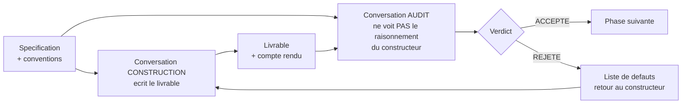

# Protocole d'audit croisé

**Aucun agent ne valide son propre travail. Chaque livrable est construit par une conversation et audité par une autre.**

---

## 1. Le principe

Un agent qui vient d'écrire du code est le plus mauvais juge de ce code : il connaît ses
intentions, donc il lit ce qu'il a voulu écrire. L'audit doit venir d'une conversation qui
n'a **pas** participé à la construction.

**Ce que l'auditeur reçoit :** la spécification, les conventions, le code produit, et le
compte rendu factuel du constructeur.

**Ce que l'auditeur ne reçoit pas :** la conversation de construction. Le raisonnement du
constructeur ancrerait l'auditeur sur les mêmes angles morts. Si le constructeur s'est
trompé sur un point qu'il croyait évident, l'auditeur doit pouvoir tomber dessus sans être
prévenu de sa conclusion.

---

## 2. Ce que l'auditeur doit faire

Dans cet ordre. Chaque étape produit un constat écrit.

| # | Étape | Ce qu'on cherche |
|---|---|---|
| **A1** | **Rejouer les tests** annoncés comme verts, soi-même | Un test annoncé vert qui ne l'est pas, ou qui n'existe pas |
| **A2** | **Lire chaque test** contre la spécification, pas contre le code | Un test qui vérifie ce que le code fait plutôt que ce que la règle dit |
| **A3** | **Écrire au moins 3 tests hostiles** que le constructeur n'a pas écrits | Ce que la spec impose et que personne n'a pensé à vérifier |
| **A4** | **Vérifier chaque critère d'acceptation**, un par un | Un critère déclaré satisfait sans preuve |
| **A5** | **Traquer les niveaux de preuve** dans le compte rendu | Un **déduit** présenté comme un **mesuré** |
| **A6** | **Chercher les valeurs en dur** et les duplications de logique | La cause racine des défauts N1 et N3 |
| **A7** | **Reconstruire chaque chiffre** du compte rendu | Un nombre que le lecteur ne peut pas retrouver |

### A3 mérite un développement

**Trois tests hostiles minimum, écrits par l'auditeur seul.** Un test hostile ne vérifie pas
que ça marche : il cherche à casser. Exemples pour un moteur de jeu :

- construire une configuration invalide et vérifier qu'elle **lève** ;
- construire deux états qui ne diffèrent **que** par une information cachée et vérifier que
  les info-set strings sont identiques ;
- vérifier qu'une carte n'est jamais à deux endroits, sur 10 000 parties aléatoires ;
- appeler une action illégale et vérifier le comportement ;
- vérifier qu'un cas rare — assassin seul dans sa zone, pioche épuisée en cours de tour —
  est traité et non ignoré.

### A5 mérite un développement

C'est l'audit le plus rentable, parce que c'est l'erreur qui a coûté le plus cher au projet.
L'auditeur relit le compte rendu et, pour **chaque affirmation factuelle**, demande : est-ce
exécuté, ou raisonné ?

Cas réels rencontrés dans ce projet :

| Affirmation | Présentée comme | Réalité |
|---|---|---|
| « `is_done` à 4 joueurs fait jouer un tour de plus aux premiers joueurs » | mesuré | **déduit d'une docstring**, jamais exécuté ; la vérification tentée ensuite utilisait un harnais faux |
| « l'encodage est injectif, 0 incohérence d'actions légales » | mesuré exhaustivement | **partiellement** : la traversée shardée utilisait `setdefault`, les répétitions intra-shard n'étaient pas comparées |
| « il faut retirer 6 cartes à 4 joueurs » | règle du jeu | **inventée**, avec une justification cohérente construite par-dessus |

Les trois ont l'air solides à la lecture. Deux ont été détectées par relecture humaine, une
par auto-audit. **Aucune n'aurait été détectée par le constructeur relisant son propre
travail.**

---

## 3. Le verdict

L'auditeur conclut par **un mot**, puis la justification.

| Verdict | Condition | Suite |
|---|---|---|
| **ACCEPTÉ** | Tous les critères d'acceptation vérifiés par l'auditeur lui-même, aucun défaut bloquant, tests hostiles verts | Phase suivante |
| **ACCEPTÉ SOUS RÉSERVE** | Aucun défaut bloquant, mais des points mineurs listés | Phase suivante, réserves reportées au journal |
| **REJETÉ** | Au moins un critère non satisfait, ou un test hostile rouge, ou une affirmation fausse dans le compte rendu | Retour au constructeur avec la liste numérotée |

**Un auditeur qui ne trouve rien doit le justifier.** « Tout est correct » sans les sept
constats A1 à A7 n'est pas un audit. S'il n'a écrit aucun test hostile, le verdict est
irrecevable.

**L'auditeur ne corrige pas.** Il constate et rend le verdict. La correction revient au
constructeur — sinon on perd la séparation et l'auditeur devient juge et partie au tour
suivant.

---

## 4. Le cycle complet d'une phase

| Étape | Qui | Conversation | Livrable |
|---|---|---|---|
| 1 | Humain | — | Valide la spécification de la phase |
| 2 | Agent constructeur | **neuve** | Le code + le compte rendu au format [08](08_modele_compte_rendu.md) |
| 3 | Agent auditeur | **neuve, distincte** | Le verdict + les constats A1-A7 + les tests hostiles |
| 4 | Humain | — | Lit le verdict, tranche |
| 5 | Agent constructeur | reprise de la conv. 2 | Corrige les défauts listés |
| 6 | Agent auditeur | reprise de la conv. 3 | Re-vérifie **uniquement** les défauts listés |
| 7 | Humain | — | Reporte le résultat au [journal](06_journal_decisions.md) |

**Deux conversations par phase au minimum.** Trois si l'audit rejette et qu'un second tour
est nécessaire.

**Pourquoi des conversations neuves et non des sous-agents.** Une conversation neuve repart
du corpus documentaire, pas du contexte accumulé. C'est précisément ce qu'on veut : si le
corpus est insuffisant, l'audit le révèle. Un sous-agent héritant du contexte masquerait les
trous de la documentation.

---

## 5. Ce qui rend un audit irrecevable

| Symptôme | Pourquoi c'est disqualifiant |
|---|---|
| Aucun test hostile écrit | L'auditeur a relu, il n'a pas audité |
| Verdict rendu sans avoir exécuté les tests soi-même | Il a cru le compte rendu |
| « Les tests passent » sans nombre | Invérifiable |
| Aucune distinction mesuré / déduit / supposé | L'erreur la plus coûteuse du projet reste invisible |
| Un défaut trouvé mais corrigé par l'auditeur | Séparation perdue |
| Le constructeur et l'auditeur sont la même conversation | Le protocole n'a pas été suivi |

---

## 6. Limites de ce protocole

- **Il ne protège pas contre une spécification fausse.** Constructeur et auditeur lisent le
  même document ; si la règle y est mal écrite, les deux la respecteront. Seule la
  confrontation à la règle officielle du jeu de plateau peut couvrir ce risque, et elle
  n'a pas été faite.
- **Il ne protège pas contre un angle mort partagé.** Deux agents du même modèle peuvent
  manquer la même chose. C'est pourquoi les tests hostiles de l'auditeur doivent être
  écrits **avant** de lire le code du constructeur.
- **Il coûte au minimum deux conversations par phase.** C'est le prix. L'alternative a été
  essayée : cinq briques validées, deux règles du jeu violées, découvert trois mois plus
  tard.
